**L O G 4 3 0**

Architecture logicielle — Été 2026

**Phase 1 — Architecture basée par services**

**(microservices)**

Dossier d’architecture — gabarit Arc42 + vues 4+1 + ADR

*Projet CanTelcoX — Système de support commercial (BSS) télécom*

|                                   |                                            |
|-----------------------------------|--------------------------------------------|
| **Équipe / N° d’équipe**          | *[À compléter — nom d’équipe et numéro]* |
| **Membres (nom, code permanent)** | *[À compléter — liste des membres]*      |
| **Cours / Groupe**                | LOG430 — Groupe ___                     |
| **Session**                       | Été 2026                                   |
| **Date de remise**                | 30 juin 2026, 23 h 59 (Moodle)             |
| **Version du document**           | v0.1 — 2026-06-20                         |

École de technologie supérieure — Département de génie logiciel et des TI

# Sommaire

*Mettez à jour le sommaire dans Word (clic droit → « Mettre à jour les champs ») une fois le document complété.*

[Sommaire](#sommaire)

[Comment utiliser ce gabarit](#comment-utiliser-ce-gabarit)

[Correspondance Tâches de l’énoncé → Sections du document](#correspondance-tâches-de-lénoncé-sections-du-document)

[1. Introduction et objectifs](#introduction-et-objectifs)

[1.1 Aperçu des exigences](#aperçu-des-exigences)

[1.2 Cas d’utilisation Must (MoSCoW)](#cas-dutilisation-must-moscow)

[1.3 Objectifs de qualité](#objectifs-de-qualité)

[1.4 Parties prenantes](#parties-prenantes)

[2. Contraintes d’architecture](#contraintes-darchitecture)

[2.1 Contraintes techniques](#contraintes-techniques)

[2.2 Contraintes réglementaires & conformité](#contraintes-réglementaires-conformité)

[2.3 Contraintes organisationnelles & conventions](#contraintes-organisationnelles-conventions)

[3. Contexte et périmètre](#contexte-et-périmètre)

[3.1 Contexte métier](#contexte-métier)

[3.2 Contexte technique](#contexte-technique)

[3.3 Cartographie du domaine (DDD)](#cartographie-du-domaine-ddd)

[4. Stratégie de solution](#stratégie-de-solution)

[4.1 Style architectural & découpage en services](#style-architectural-découpage-en-services)

[4.2 Communication inter-services](#communication-inter-services)

[4.3 Stratégie de l’API REST](#stratégie-de-lapi-rest)

[4.4 Référence industrielle TMF (optionnelle)](#référence-industrielle-tmf-optionnelle)

[5. Vue des blocs de construction](#vue-des-blocs-de-construction)

[5.1 Niveau 1 — Whitebox du système global](#niveau-1-whitebox-du-système-global)

[5.2 Niveau 2 — Structure interne d’un service (hexagonal)](#niveau-2-structure-interne-dun-service-hexagonal)

[5.3 Modèle de domaine](#modèle-de-domaine)

[5.4 Organisation du code (vue Développement)](#organisation-du-code-vue-développement)

[6. Vue d’exécution](#vue-dexécution)

[6.1 Scénario bout-en-bout (E2E)](#scénario-bout-en-bout-e2e)

[6.2 Authentification & MFA (UC-02)](#authentification-mfa-uc-02)

[6.3 Idempotence & exactly-once à l’exécution](#idempotence-exactly-once-à-lexécution)

[7. Vue de déploiement](#vue-de-déploiement)

[7.1 Topologie de déploiement](#topologie-de-déploiement)

[7.2 API Gateway](#api-gateway)

[7.3 Load balancing & tolérance aux pannes](#load-balancing-tolérance-aux-pannes)

[8. Concepts transversaux](#concepts-transversaux)

[8.1 Persistance & intégrité](#persistance-intégrité)

[8.2 Idempotence (commandes & activations)](#idempotence-commandes-activations)

[8.3 Exactly-once (facturation)](#exactly-once-facturation)

[8.4 Journal d’audit append-only (CRTC / Loi 25)](#journal-daudit-append-only-crtc-loi-25)

[8.5 Sécurité applicative](#sécurité-applicative)

[8.6 Contrôles anti-fraude](#contrôles-anti-fraude)

[8.7 Gestion d’erreurs & versionnement](#gestion-derreurs-versionnement)

[8.8 Observabilité (4 Golden Signals)](#observabilité-4-golden-signals)

[8.9 Caching](#caching)

[9. Décisions d’architecture (ADR)](#décisions-darchitecture-adr)

[ADR-001 — Style architectural & découpage en services](#adr-001-style-architectural-découpage-en-services)

[ADR-002 — Persistance & transactions (idempotence / exactly-once / append-only)](#adr-002-persistance-transactions-idempotence-exactly-once-append-only)

[ADR-003 — Stratégie d’erreurs & versionnement d’API](#adr-003-stratégie-derreurs-versionnement-dapi)

[10. Exigences de qualité](#exigences-de-qualité)

[10.1 Arbre de qualité](#arbre-de-qualité)

[10.2 Scénarios de qualité](#scénarios-de-qualité)

[10.3 Cibles NFR & résultats](#cibles-nfr-résultats)

[10.4 Stratégie de tests & couverture](#stratégie-de-tests-couverture)

[10.5 Résultats des campagnes de charge](#résultats-des-campagnes-de-charge)

[10.6 Load balancing (N = 1..4) & tolérance aux pannes](#load-balancing-n-1..4-tolérance-aux-pannes)

[10.7 Caching (on / off)](#caching-on-off)

[10.8 Appels directs vs via Gateway](#appels-directs-vs-via-gateway)

[11. Risques et dette technique](#risques-et-dette-technique)

[12. Glossaire](#glossaire)

[12.1 Langage métier](#langage-métier)

[12.2 Acronymes](#acronymes)

[Annexe A — Contrats d’API & catalogue d’endpoints](#annexe-a-contrats-dapi-catalogue-dendpoints)

[Annexe B — Schéma de persistance](#annexe-b-schéma-de-persistance)

[Annexe C — CI/CD, conteneurisation & exploitation](#annexe-c-cicd-conteneurisation-exploitation)

[Annexe D — Traçabilité, Définition de Fini & auto-évaluation](#annexe-d-traçabilité-définition-de-fini-auto-évaluation)

[D.1 Matrice de traçabilité (livrables & critères d’acceptation)](#d.1-matrice-de-traçabilité-livrables-critères-dacceptation)

[D.2 Définition de Fini (DoD)](#d.2-définition-de-fini-dod)

[D.3 Auto-évaluation (grille de l’énoncé)](#d.3-auto-évaluation-grille-de-lénoncé)

[Annexe E — Soutenance et démonstration (20 %)](#annexe-e-soutenance-et-démonstration-20)

[E.1 Déroulé attendu](#e.1-déroulé-attendu)

[E.2 Grille de soutenance](#e.2-grille-de-soutenance)

[E.3 Plan de soutenance (à préparer)](#e.3-plan-de-soutenance-à-préparer)

# Comment utiliser ce gabarit

Ce gabarit structure le dossier d’architecture de la Phase 1 selon le modèle Arc42 (sections 1 à 12) et y intègre les cinq vues 4+1. Chaque section rappelle, dans une boîte « Repères de l’énoncé », les tâches concernées, les livrables attendus et les critères d’acceptation (CA) à cocher. Remplacez chaque mention [À compléter — …] par votre contenu, insérez vos diagrammes là où indiqué, puis cochez les CA au fur et à mesure.

> **Conventions**
>
> - Texte en gris entre crochets = consigne à remplacer par votre contenu.
> - Cases ☐ = critères d’acceptation de l’énoncé ; cochez-les lorsque la preuve est dans le dépôt ou le rapport.
> - Insérez les diagrammes (PlantUML, Mermaid, draw.io…) sous forme d’images exportées ; nommez-les et numérotez les figures.
> - Le dossier final est remis en PDF ; ce gabarit Word sert de source. Visez la reproductibilité < 30 min sur la VM.
> - **Le gabarit est une structure minimale, pas un plafond :** ajoutez toute sous-section ou tout contenu pertinent demandé par l’énoncé. Les justifications de décisions (« pourquoi ce choix plutôt qu’un autre ») vont en priorité dans les ADR (§9) et la colonne « Justification (→ ADR) » du §4 ; les sections descriptives (§1–§8) présentent surtout l’architecture retenue.

## Correspondance Tâches de l’énoncé → Sections du document

Tableau de navigation : où documenter chaque tâche du devoir. La matrice de traçabilité détaillée (avec statut) figure en Annexe D.

| **Tâche (énoncé)**                  | **Où la documenter**                                              |
|-------------------------------------|-------------------------------------------------------------------|
| 1.1 Cas d’utilisation Must (MoSCoW) | **§1 Introduction & objectifs · §10 Scénarios de qualité**        |
| 1.2 Cartographie DDD                | **§3 Carte des contextes · §5 Modèle de domaine · §12 Glossaire** |
| 2.1 Découpage microservices         | **§4 Stratégie de solution · §5 Vue des blocs**                   |
| 2.2 Couche API REST                 | **§4.4 · Annexe A (contrats OpenAPI/Postman)**                    |
| 2.3 Documentation 4+1 + Arc42       | Ensemble du document                                              |
| 2.4 ADR (≥ 3)                       | **§9 Décisions d’architecture**                                   |
| 3.1 Schéma de persistance           | **§8.1 · Annexe B (ER/UML, migrations, seeds)**                   |
| 3.2 Persistance & intégrité         | **§8.1–8.4 · Annexe B**                                           |
| 4.1 Domaine & services applicatifs  | **§5.3 Modèle de domaine**                                        |
| 4.2 Ports/adapters                  | **§3.2 Contexte technique · §5.2 Structure interne**              |
| 4.3 API REST publique (E2E)         | **§6 Vue d’exécution · Annexe A**                                 |
| 4.4 Sécurité applicative            | **§8.5 Sécurité · §8.6 Anti-fraude**                              |
| 5.1 Observabilité                   | **§8.8 · §10.5 (dashboards)**                                     |
| 5.2 Tests de charge                 | **§10.5**                                                         |
| 5.3 Load balancing                  | **§7.3 · §10.6**                                                  |
| 5.4 Caching                         | **§8.9 · §10.7**                                                  |
| 6.1 API Gateway                     | **§7.2**                                                          |
| 6.2 Direct vs Gateway               | **§10.8**                                                         |
| 7.1 Stratégie de tests              | **§10.4**                                                         |
| 7.2 Sécurité & gestion d’erreurs    | **§8.5–8.7**                                                      |
| 8.1–8.3 CI/CD & conteneurisation    | **§7.1 · Annexe C**                                               |
| 9.1 Documentation finale            | Ensemble · Annexe C (runbook)                                     |
| 9.2 Rapport comparatif              | **§10.6–10.8**                                                    |

# 1. Introduction et objectifs

> **Repères de l’énoncé**
>
> **Tâches de l’énoncé :** 1.1 Clarifier le périmètre & cas d’utilisation Must.
>
> **Vue 4+1 :** Scénarios (cas d’utilisation).
>
> **Livrables attendus :**
>
> - UC textuels (scénario principal + alternatifs) pour ≥ 5 UC Must.
> - Priorisation MoSCoW alignée sur les domaines du cahier.

**Critères d’acceptation (à cocher)**

> ☐ ≥ 5 UC Must (parmi UC-01 à UC-08) entièrement décrits et validés.
>
> ☐ Priorisation MoSCoW justifiée et matrice de traçabilité UC ↔ domaines complétée.

## 1.1 Aperçu des exigences

CanTelcoX, opérateur mobile canadien fictif, déploie un BSS moderne pour abonnés particuliers et PME couvrant le cycle de vie des lignes mobiles : souscription, activation, consultation d’usage, prise de commande de forfaits/options, paiement de facture et conformité réglementaire.

Le dépôt actuel couvre principalement la façade **CanTelcoX API Gateway** : une API REST FastAPI exposant une URL d’entrée unique, un endpoint de santé, une table de routage et un proxy `/v1/*` vers des services métier internes. Les services déjà routés ou préparés sont `identity-service`, `order-service`, `catalog-service`, `customers-service`, `billing-service` et `audit-service`. Le périmètre implémenté et documenté correspond donc au point d’entrée API, au routage vers les microservices, à la configuration par variables d’environnement, à la conteneurisation du gateway et à une observabilité minimale par `/health`. Les UC métier complets restent à finaliser côté services amont.

## 1.2 Cas d’utilisation Must (MoSCoW)

Catalogue de référence des UC du cahier :

| **UC** | **Intitulé**                          | **Priorité MoSCoW** |
|--------|---------------------------------------|---------------------|
| UC-01  | Inscription & vérification d’identité | Must                |
| UC-02  | Authentification & MFA                | Must                |
| UC-03  | Activation d’une ligne                | Must                |
| UC-04  | Consultation usage / factures         | Must                |
| UC-05  | Prise de commande                     | Must                |
| UC-06  | Paiement de facture                   | Must                |
| UC-07  | Détection de fraude                   | Must                |
| UC-08  | Cycle de facturation mensuel          | Must                |

**Justification de la priorisation MoSCoW**

Les huit UC sont classés **Must** parce qu’ils forment le minimum viable d’un BSS télécom : identité et MFA sécurisent l’accès, activation et commandes matérialisent la vente, usage/facturation/paiement couvrent la valeur opérationnelle, et fraude/audit répondent aux contraintes réglementaires. Dans le dépôt actuel, le gateway prépare les familles de routes nécessaires à ces UC, mais les scénarios métier complets ne sont pas tous implémentés dans ce dépôt. Aucun UC Should/Could/Won’t n’est documenté à ce stade.

**Matrice de traçabilité UC ↔ domaines du cahier (bounded contexts)**

Cochez (✓) le ou les domaines couverts par chaque UC, pour démontrer l’alignement avec le cahier. Ajustez selon les UC réellement retenus.

|                                     |                        |                       |                             |                        |                         |                        |
|-------------------------------------|------------------------|-----------------------|-----------------------------|------------------------|-------------------------|------------------------|
| **UC**                              | **Clients & Identité** | **Lignes & Services** | **Commandes & Activations** | **Catalogue & Offres** | **Usage / Facturation** | **Conformité & Audit** |
| UC-01 Inscription & identité        | ✓                      |                       |                             |                        |                         | ✓                      |
| UC-02 Authentification & MFA        | ✓                      |                       |                             |                        |                         | ✓                      |
| UC-03 Activation d’une ligne        |                        | ✓                     | ✓                           | ✓                      |                         | ✓                      |
| UC-04 Consultation usage / factures |                        |                       |                             |                        | ✓                       |                        |
| UC-05 Prise de commande             |                        |                       | ✓                           | ✓                      |                         |                        |
| UC-06 Paiement de facture           |                        |                       |                             |                        | ✓                       | ✓                      |
| UC-07 Détection de fraude           |                        |                       |                             |                        |                         | ✓                      |
| UC-08 Cycle de facturation          |                        |                       |                             |                        | ✓                       | ✓                      |

**Détaillez ci-dessous les ≥ 5 UC retenus :**

| **UC** | **Acteurs** | **Préconditions** | **Scénario principal** | **Alternatifs / exceptions** | **Postconditions / règles métier** | **État dépôt** |
|--------|-------------|-------------------|-------------------------|------------------------------|------------------------------------|----------------|
| UC-01 Inscription & identité | Abonné, service identité | Gateway disponible, `IDENTITY_SERVICE_URL` configuré | Le client appelle `/v1/users/*`; le gateway route vers `identity-service`; le service crée ou vérifie le profil | Route inconnue `404`, service non configuré `503`, service indisponible `502` | Profil client créé/vérifié; accès journalisable | Route gateway prête; logique métier dans service amont |
| UC-02 Authentification & MFA | Abonné, service identité | Compte existant, route `/v1/auth/*` configurée | Le client initie l’authentification; le service identité valide les facteurs; le gateway relaie la réponse | MFA refusée ou expirée; service indisponible | Session ou jeton retourné par l’amont; opération sensible protégée | Route gateway prête; MFA non centralisé dans le gateway |
| UC-03 Activation d’une ligne | Abonné/agent, `line-service`, `order-service` | Client identifié, commande ou ligne admissible | Le client ou `order-service` déclenche `/v1/lines/activations`; `line-service` active la ligne via free5GC | Double soumission, fraude, free5GC indisponible | Ligne active une seule fois; audit attendu | Routage lignes à configurer; adapter free5GC à compléter |
| UC-04 Consultation usage/factures | Abonné, service facturation/usage | Client authentifié, facturation disponible | Le client appelle `/v1/billing/*`; le gateway route vers le service facturation | Service non configuré `503`; service indisponible `502` | Usage/factures consultables selon droits | Conteneur LXC et URL configurés; application métier à déployer |
| UC-05 Prise de commande | Abonné/agent, service commandes, catalogue | Catalogue et service commande disponibles | Le client consulte `/v1/catalog/*`, puis soumet `/v1/orders/*`; le gateway relaie les appels | Offre inexistante, commande invalide, double soumission | Commande enregistrée; idempotence attendue côté service | Routes catalogue/commandes prêtes; idempotence métier à compléter |
| UC-06 Paiement de facture | Abonné, service facturation, passerelle paiement | Facture ouverte, passerelle simulée disponible | Le client appelle `/v1/billing/*` pour payer; le service facturation orchestre le paiement | Paiement refusé, doublon, passerelle indisponible | Paiement appliqué une seule fois; audit requis | Route préparée; service/passerelle à compléter |
| UC-07 Détection de fraude | Services métier, service audit/fraude | Événements métier disponibles | Les services publient ou appellent `/v1/audit/*` pour consigner les opérations sensibles | Suspicion SIM swap, usurpation, roaming anormal | Décision de blocage ou alerte; journal append-only | Route audit préparée; règles anti-fraude à compléter |
| UC-08 Cycle de facturation | Service facturation, exploitation | Usage collecté, période close | Le service facturation calcule les factures mensuelles et écrit les opérations | Rejeu de batch, doublons d’écriture | Exactly-once attendu pour les écritures de facturation | Hors gateway; à implémenter/mesurer |

### UC-01 — Inscription & vérification d’identité

**Objectif**

Permettre à un nouvel abonné particulier ou PME de créer un profil client et de déclencher la vérification de son identité avant l’accès aux services télécom.

**Acteur principal**

Nouvel abonné CanTelcoX.

**Acteurs secondaires**

Frontend Expo, API Gateway, `identity-service`, service d’audit, système externe simulé de vérification d’identité.

**Préconditions**

- Le gateway est disponible.
- `IDENTITY_SERVICE_URL` est configuré.
- Le client possède les informations nécessaires à l’inscription.
- Le service identité est joignable.

**Déclencheur**

Le client soumet le formulaire d’inscription depuis le frontend ou un client API.

**Scénario principal**

1. Le client remplit le formulaire d’inscription dans le frontend Expo.
2. Le frontend envoie une requête HTTP vers l’API Gateway sur une route publique `/v1/users/*`.
3. L’API Gateway identifie le segment `users`.
4. Le gateway relaie la requête vers `identity-service` en conservant la méthode HTTP, le corps et les headers applicatifs.
5. `identity-service` valide les champs obligatoires.
6. `identity-service` vérifie que le client n’existe pas déjà.
7. Le profil abonné est créé avec un statut de vérification.
8. Le service retourne une réponse de succès au gateway.
9. Le gateway relaie la réponse au frontend, qui affiche la confirmation au client.

**Scénarios alternatifs / exceptions**

2a. Route publique inconnue : le gateway retourne `404`.
<ol>
<li>Retour à l’étape 1.</li>
</ol>

4a. Service identité non configuré : le gateway retourne `503`.
<ol>
<li>Fin du cas.</li>
</ol>

4b. Service identité indisponible : le gateway retourne `502`.
<ol>
<li>Fin du cas; le client peut réessayer plus tard.</li>
</ol>

5a. `identity-service` ne valide pas les champs obligatoires : le service identité refuse la demande avec `400` ou `422`.
<ol>
<li>Retour à l’étape 1 pour corriger le formulaire.</li>
</ol>

6a. `identity-service` remarque que le client existe déjà : le service retourne `409 Conflict`.
<ol>
<li>Va à UC-02 Authentification & MFA.</li>
</ol>

7a. Vérification d’identité refusée : le profil est rejeté ou créé avec un statut non vérifié, selon la règle métier retenue.
<ol>
<li>Fin du cas; le client doit corriger ses informations ou contacter le support.</li>
</ol>

**Postconditions de succès**

Un profil abonné existe dans le contexte Clients & Identité; son statut d’identité est enregistré; une entrée d’audit trace l’inscription et la vérification; le client peut poursuivre vers UC-02 Authentification & MFA.

**Postconditions d’échec**

Aucun profil complet n’est activé; l’erreur est retournée au client; l’échec significatif peut être journalisé.

**Règles métier**

- Un identifiant client unique doit être garanti.
- Les données personnelles doivent être validées et protégées.
- Aucune activation de ligne ne doit être possible sans identité vérifiée ou statut explicitement admissible.
- L’inscription est une opération auditée.

**Priorité MoSCoW**

Must.

**État actuel dans le dépôt**

La route gateway `/v1/users/*` est prête et routée vers `identity-service`. La logique métier complète de création de profil, vérification d’identité et audit doit être confirmée ou complétée dans les services amont.

### UC-02 — Authentification & MFA

**Objectif**

Permettre à un abonné déjà inscrit de s’authentifier et de valider un second facteur afin d’accéder aux fonctionnalités protégées de CanTelcoX.

**Acteur principal**

Abonné CanTelcoX.

**Acteurs secondaires**

Frontend Expo, API Gateway, `identity-service`, service d’audit, mécanisme OTP/MFA.

**Préconditions**

- Le gateway est disponible.
- `IDENTITY_SERVICE_URL` est configuré.
- Le client possède un profil abonné existant.
- Le service identité est joignable.
- Le mécanisme MFA/OTP est disponible ou simulé par `identity-service`.

**Déclencheur**

Le client soumet ses informations de connexion depuis le frontend Expo.

**Scénario principal**

1. Le client saisit ses identifiants dans le frontend Expo.
2. Le frontend envoie une requête HTTP vers l’API Gateway sur une route publique `/v1/auth/*`.
3. L’API Gateway identifie le segment `auth`.
4. Le gateway relaie la requête vers `identity-service` en conservant la méthode HTTP, le corps et les headers applicatifs.
5. `identity-service` valide les identifiants du client.
6. Le frontend affiche l’écran **Canal MFA** avec les canaux configurés du compte, par exemple Courriel ou SMS.
7. Le client choisit le canal MFA et clique sur **Continuer**.
8. Le frontend transmet le canal choisi au gateway.
9. Le gateway relaie le canal choisi vers `identity-service`.
10. `identity-service` génère un code MFA ou OTP.
11. `identity-service` envoie le code au client par le canal choisi.
12. Le client saisit le code MFA dans le frontend.
13. Le frontend envoie le code MFA au gateway.
14. Le gateway relaie la validation MFA vers `identity-service`.
15. `identity-service` valide le code MFA.
16. `identity-service` retourne une réponse d’authentification réussie au gateway.
17. Le gateway relaie la réponse au frontend, qui donne accès à l’espace client.

**Scénarios alternatifs / exceptions**

2a. Route publique inconnue : le gateway retourne `404`.
<ol>
<li>Retour à l’étape 1.</li>
</ol>

4a. Service identité non configuré : le gateway retourne `503`.
<ol>
<li>Fin du cas.</li>
</ol>

4b. Service identité indisponible : le gateway retourne `502`.
<ol>
<li>Fin du cas; le client peut réessayer plus tard.</li>
</ol>

5a. `identity-service` ne valide pas les identifiants : le service refuse l’authentification avec `401`.
<ol>
<li>Retour à l’étape 1 pour ressaisir les identifiants.</li>
</ol>

6a. Le client ne possède aucun canal MFA configuré : `identity-service` refuse la poursuite du MFA.
<ol>
<li>Fin du cas; le client doit configurer un canal MFA avant de réessayer.</li>
</ol>

7a. Le client annule ou revient à l’écran précédent au moment de choisir le canal MFA.
<ol>
<li>Retour à l’étape 1 ou fin du cas.</li>
</ol>

9a. Le canal choisi n’est pas valide ou n’est plus disponible : `identity-service` refuse le canal.
<ol>
<li>Retour à l’étape 6 pour choisir un autre canal si disponible; sinon fin du cas.</li>
</ol>

10a. Le code MFA ne peut pas être généré : `identity-service` retourne une erreur et aucune session n’est ouverte.
<ol>
<li>Fin du cas; le client peut réessayer plus tard.</li>
</ol>

11a. Le code MFA ne peut pas être envoyé au client : `identity-service` retourne une erreur ou demande un autre canal.
<ol>
<li>Retour à l’étape 6 avec un autre canal si disponible; sinon fin du cas.</li>
</ol>

12a. Le client saisit le mauvais code MFA : `identity-service` refuse l’authentification avec `401` ou `403`.
<ol>
<li>Retour à l’étape 12 tant que le nombre maximal de tentatives n’est pas atteint.</li>
</ol>

15b. Le nombre maximal de tentatives MFA est atteint : `identity-service` bloque temporairement la validation et journalise l’événement.
<ol>
<li>Fin du cas.</li>
</ol>

**Postconditions de succès**

Le client est authentifié; une session ou un jeton d’accès est retourné; l’événement d’authentification/MFA est traçable par audit; le client peut accéder aux fonctions protégées selon ses droits.

**Postconditions d’échec**

Aucune session valide n’est créée; l’erreur est retournée au frontend; les échecs significatifs sont journalisés pour audit ou détection de fraude.

**Règles métier**

- Un client doit exister avant de pouvoir s’authentifier.
- Les identifiants invalides ne doivent pas révéler si le compte existe.
- Un MFA valide est requis pour accéder aux opérations sensibles.
- Les tentatives échouées doivent être limitées ou journalisées.
- L’authentification réussie doit produire une preuve exploitable par les autres services.

**Priorité MoSCoW**

Must.

**État actuel dans le dépôt**

La route gateway `/v1/auth/*` est prête et routée vers `identity-service`. Le gateway relaie les requêtes d’authentification, mais la validation des identifiants, la génération MFA/OTP, la politique de tentatives et la création de session doivent être confirmées ou complétées dans `identity-service`.

### UC-03 — Activation d’une ligne

**Objectif**

Permettre à un abonné authentifié d’activer une ligne mobile associée à une commande ou à un forfait admissible.

**Acteur principal**

Abonné CanTelcoX.

**Acteurs secondaires**

Frontend Expo, API Gateway, `order-service`, `line-service`, `catalog-service`, service d’audit, coeur réseau free5GC et UERANSIM pour l’accès 5G simulé.

**Préconditions**

- Le gateway est disponible.
- Le client est authentifié et a réussi le MFA requis par UC-02.
- `ORDER_SERVICE_URL` est configuré.
- La commande ou le forfait à activer existe.
- La ligne n’est pas déjà active.
- `line-service` est joignable.
- L’adapter free5GC de `line-service` est configuré avec les paramètres SUPI/SIM, DNN et slice nécessaires au laboratoire.

**Déclencheur**

Le client confirme l’activation d’une ligne depuis le frontend Expo.

**Scénario principal**

1. Le client sélectionne la commande ou la ligne à activer dans le frontend Expo.
2. Le frontend envoie une requête HTTP vers l’API Gateway sur une route publique `/v1/lines/activations`, ou `order-service` déclenche cette route après confirmation de commande.
3. L’API Gateway identifie le segment `lines`.
4. Le gateway relaie la requête vers `line-service` en conservant la méthode HTTP, le corps, les headers applicatifs et la preuve d’authentification.
5. `line-service` vérifie que le client est autorisé à activer la ligne ou que la demande provient d’une commande admissible.
6. `line-service` vérifie que la commande ou le forfait est admissible à l’activation.
7. `line-service` vérifie que la ligne n’est pas déjà active.
8. `line-service` transmet la demande à l’adapter free5GC.
9. `line-service` provisionne le profil SIM/SUPI et vérifie l’état réseau dans free5GC.
10. `line-service` retourne une réponse de succès au gateway ou à `order-service`.
11. Le gateway relaie la réponse au frontend, qui affiche la ligne comme activée.

**Scénarios alternatifs / exceptions**

2a. Route publique inconnue : le gateway retourne `404`.
<ol>
<li>Retour à l’étape 1.</li>
</ol>

4a. Service commandes non configuré : le gateway retourne `503`.
<ol>
<li>Fin du cas.</li>
</ol>

4b. Service commandes indisponible : le gateway retourne `502`.
<ol>
<li>Fin du cas; le client peut réessayer plus tard.</li>
</ol>

5a. `line-service` ne valide pas l’autorisation du client : le service refuse l’activation avec `401` ou `403`.
<ol>
<li>Va à UC-02 Authentification & MFA si la session est absente ou expirée; sinon fin du cas.</li>
</ol>

6a. La commande ou le forfait n’est pas admissible : `line-service` refuse l’activation avec `409` ou `422`.
<ol>
<li>Retour à l’étape 1 pour choisir une commande ou une offre admissible.</li>
</ol>

7a. La ligne est déjà active : `line-service` retourne `409 Conflict`.
<ol>
<li>Fin du cas; le frontend affiche l’état actuel de la ligne.</li>
</ol>

8a. Le coeur free5GC est indisponible : `line-service` retourne une erreur.
<ol>
<li>Fin du cas; la demande peut être rejouée plus tard avec la même clé d’idempotence si elle existe.</li>
</ol>

9a. L’activation échoue côté service lignes : aucune ligne active n’est confirmée.
<ol>
<li>Fin du cas; l’échec est journalisé et le client peut réessayer plus tard.</li>
</ol>

**Postconditions de succès**

La ligne mobile est active; son état est associé au client et à la commande; une entrée d’audit trace l’activation; le client peut utiliser les services associés à son forfait.

**Postconditions d’échec**

Aucune nouvelle activation n’est confirmée; l’état de la ligne reste inchangé ou marqué en échec selon la règle métier; l’erreur est retournée au frontend; les échecs significatifs sont journalisés.

**Règles métier**

- Une ligne ne doit être activée qu’une seule fois.
- L’activation requiert un client authentifié et MFA valide.
- La commande ou l’offre doit être admissible.
- Une double soumission ne doit pas produire deux activations.
- Les opérations d’activation doivent être auditables.

**Priorité MoSCoW**

Must.

**État actuel dans le dépôt**

La route gateway `/v1/lines/*` est configurée vers `line-service` via `LINE_SERVICE_URL=http://100.86.218.1:8080`. Le gateway peut transporter les headers applicatifs nécessaires, mais la logique complète d’activation, l’idempotence et l’intégration free5GC doivent être validées dans `line-service`.

### UC-04 — Consultation usage / factures

**Objectif**

Permettre à un abonné authentifié de consulter son usage mobile et ses factures depuis l’espace client.

**Acteur principal**

Abonné CanTelcoX.

**Acteurs secondaires**

Frontend Expo, API Gateway, `billing-service`, service usage/rating, service d’audit.

**Préconditions**

- Le gateway est disponible.
- Le client est authentifié.
- `BILLING_SERVICE_URL` est configuré.
- Le service facturation/usage est joignable.
- Le client possède au moins une ligne ou un compte facturable.

**Déclencheur**

Le client ouvre la page usage ou factures dans le frontend Expo.

**Scénario principal**

1. Le client sélectionne la consultation d’usage ou de factures dans le frontend Expo.
2. Le frontend envoie une requête HTTP vers l’API Gateway sur une route publique `/v1/billing/*`.
3. L’API Gateway identifie le segment `billing`.
4. Le gateway relaie la requête vers `billing-service` en conservant la méthode HTTP, les paramètres de requête et la preuve d’authentification.
5. `billing-service` vérifie que le client est autorisé à consulter le compte demandé.
6. `billing-service` récupère les données d’usage ou les factures disponibles.
7. `billing-service` prépare une réponse avec les montants, périodes, statuts et détails pertinents.
8. `billing-service` retourne la réponse au gateway.
9. Le gateway relaie la réponse au frontend, qui affiche les données au client.

**Scénarios alternatifs / exceptions**

2a. Route publique inconnue : le gateway retourne `404`.
<ol>
<li>Retour à l’étape 1.</li>
</ol>

4a. Service facturation non configuré : le gateway retourne `503`.
<ol>
<li>Fin du cas.</li>
</ol>

4b. Service facturation indisponible : le gateway retourne `502`.
<ol>
<li>Fin du cas; le client peut réessayer plus tard.</li>
</ol>

5a. `billing-service` ne valide pas l’autorisation du client : le service refuse la consultation avec `401` ou `403`.
<ol>
<li>Va à UC-02 Authentification & MFA si la session est absente ou expirée; sinon fin du cas.</li>
</ol>

6a. Aucune facture ou donnée d’usage n’est disponible : `billing-service` retourne une liste vide ou un statut approprié.
<ol>
<li>Fin du cas; le frontend affiche qu’aucune donnée n’est disponible.</li>
</ol>

6b. La ligne ou le compte demandé n’existe pas : `billing-service` retourne `404`.
<ol>
<li>Retour à l’étape 1 pour choisir un autre compte ou une autre ligne.</li>
</ol>

7a. Les données ne peuvent pas être calculées ou agrégées : `billing-service` retourne une erreur.
<ol>
<li>Fin du cas; l’erreur est journalisée et le client peut réessayer plus tard.</li>
</ol>

**Postconditions de succès**

Les informations d’usage ou de facturation sont affichées au client; l’accès peut être journalisé; aucune donnée de facturation n’est modifiée.

**Postconditions d’échec**

Aucune donnée sensible n’est exposée sans autorisation; l’erreur est retournée au frontend; les échecs significatifs sont journalisés.

**Règles métier**

- Un client ne peut consulter que ses propres lignes, comptes et factures.
- Les données personnelles et de facturation doivent être protégées.
- Une consultation ne doit pas modifier l’état des factures.
- Les accès aux informations sensibles doivent être auditables.

**Priorité MoSCoW**

Must.

**État actuel dans le dépôt**

La route gateway `/v1/billing/*` est préparée et `BILLING_SERVICE_URL` pointe maintenant vers le conteneur LXC `100.114.185.38:8060`. Tant que l’application de facturation n’écoute pas sur ce port, le gateway retourne `502`. La logique de consultation usage/factures doit encore être implémentée ou déployée dans `billing-service`.

### UC-05 — Prise de commande

**Objectif**

Permettre à un abonné authentifié de commander un forfait, une option ou un service mobile à partir du catalogue CanTelcoX.

**Acteur principal**

Abonné CanTelcoX.

**Acteurs secondaires**

Frontend Expo, API Gateway, `catalog-service`, `order-service`, service d’audit.

**Préconditions**

- Le gateway est disponible.
- Le client est authentifié.
- `CATALOG_SERVICE_URL` et `ORDER_SERVICE_URL` sont configurés.
- Le catalogue contient au moins une offre active.
- Le service commandes est joignable.

**Déclencheur**

Le client sélectionne une offre dans le frontend Expo et confirme la commande.

**Scénario principal**

1. Le client consulte le catalogue de forfaits ou d’options dans le frontend Expo.
2. Le frontend envoie une requête HTTP vers l’API Gateway sur une route publique `/v1/catalog/*`.
3. Le gateway relaie la requête vers `catalog-service`.
4. `catalog-service` retourne les offres actives au gateway.
5. Le gateway relaie les offres au frontend.
6. Le client sélectionne une offre et confirme la commande.
7. Le frontend envoie la commande vers l’API Gateway sur une route publique `/v1/orders/*`.
8. Le gateway relaie la commande vers `order-service` avec la preuve d’authentification et, si disponible, une clé d’idempotence.
9. `order-service` vérifie que le client est autorisé à commander.
10. `order-service` vérifie que l’offre existe et est admissible.
11. `order-service` crée la commande avec un statut initial.
12. `order-service` retourne la confirmation au gateway.
13. Le gateway relaie la confirmation au frontend, qui affiche le statut de la commande.

**Scénarios alternatifs / exceptions**

2a. Route catalogue inconnue : le gateway retourne `404`.
<ol>
<li>Retour à l’étape 1.</li>
</ol>

3a. Service catalogue non configuré ou indisponible : le gateway retourne `503` ou `502`.
<ol>
<li>Fin du cas; le client peut réessayer plus tard.</li>
</ol>

4a. Aucune offre active n’est disponible : `catalog-service` retourne une liste vide.
<ol>
<li>Fin du cas; le frontend affiche qu’aucune offre n’est disponible.</li>
</ol>

7a. Route commande inconnue : le gateway retourne `404`.
<ol>
<li>Retour à l’étape 6.</li>
</ol>

8a. Service commandes non configuré ou indisponible : le gateway retourne `503` ou `502`.
<ol>
<li>Fin du cas; le client peut réessayer plus tard.</li>
</ol>

9a. `order-service` ne valide pas l’autorisation du client : le service refuse la commande avec `401` ou `403`.
<ol>
<li>Va à UC-02 Authentification & MFA si la session est absente ou expirée; sinon fin du cas.</li>
</ol>

10a. L’offre sélectionnée n’existe plus ou n’est pas admissible : `order-service` retourne `404`, `409` ou `422`.
<ol>
<li>Retour à l’étape 1 pour choisir une autre offre.</li>
</ol>

11a. Une commande identique est resoumise avec la même clé d’idempotence : `order-service` retourne le résultat déjà créé sans créer de doublon.
<ol>
<li>Va à l’étape 13.</li>
</ol>

11b. La commande ne peut pas être créée : `order-service` retourne une erreur et aucune commande active n’est enregistrée.
<ol>
<li>Fin du cas; l’échec est journalisé et le client peut réessayer plus tard.</li>
</ol>

**Postconditions de succès**

Une commande est créée avec un statut initial; la commande est associée au client et à l’offre; une entrée d’audit trace la prise de commande; le client peut suivre la commande ou poursuivre vers UC-03 Activation d’une ligne si l’offre le permet.

**Postconditions d’échec**

Aucune nouvelle commande valide n’est créée; l’erreur est retournée au frontend; les échecs significatifs sont journalisés.

**Règles métier**

- Une commande doit référencer une offre active et admissible.
- Un client doit être authentifié pour commander.
- Une double soumission avec la même clé d’idempotence ne doit pas créer de doublon.
- Le prix et les conditions de l’offre doivent être ceux validés au moment de la commande.
- Les commandes doivent être auditables.

**Priorité MoSCoW**

Must.

**État actuel dans le dépôt**

Les routes gateway `/v1/catalog/*` et `/v1/orders/*` sont prêtes. `ORDER_SERVICE_URL` est configuré par défaut localement et `CATALOG_SERVICE_URL` est configurable. La création effective de commande, la validation d’admissibilité et l’idempotence doivent être confirmées ou complétées dans `order-service` et `catalog-service`.

## 1.3 Objectifs de qualité

Les trois objectifs de qualité prioritaires (cibles NFR du cahier) :

| **Objectif de qualité** | **Scénario / motivation**                                 | **Cible mesurable**                                       |
|-------------------------|-----------------------------------------------------------|-----------------------------------------------------------|
| Performance             | Réactivité sous charge nominale (UC-04/05)                | Latence P95 ≤ 500 ms                                      |
| Débit / capacité        | Soutenir le trafic pic                                    | ≥ 600 opérations/s                                        |
| Disponibilité           | Continuité de service (panne d’instance)                  | Disponibilité 95 %                                        |
| Sécurité & auditabilité | MFA, anti-fraude, journal append-only, secrets hors code | 0 secret applicatif en clair; audit immuable à implémenter côté `audit-service` |

## 1.4 Parties prenantes

| **Partie prenante**        | **Rôle / attente**            | **Section concernée** |
|----------------------------|-------------------------------|-----------------------|
| Abonnés particuliers / PME | Souscription, usage, paiement | **§1, §6**            |
| Opérateur (exploitation)   | Disponibilité, observabilité  | **§7, §8.8, §10**     |
| Régulateur (CRTC, Loi 25)  | Conformité, auditabilité      | **§2, §8.4, §9**      |
| Équipe backend             | Contrats API, découpage services, maintenabilité | **§4, §5, §9** |
| Enseignants / évaluateurs LOG430 | Vérifier les choix d’architecture, l’exécution et les preuves | **§9, §10, Annexes** |

# 2. Contraintes d’architecture

## 2.1 Contraintes techniques

| **Contrainte**          | **Description / impact**                                                        |
|-------------------------|---------------------------------------------------------------------------------|
| Déploiement             | Machine virtuelle fournie ; conteneurisation Docker ; docker compose up unique. |
| Communication (Phase 1) | Synchrone REST entre services.                                                  |
| Documentation           | OpenAPI/Swagger ; modèle Arc42 ; vues 4+1 ; ≥ 3 ADR.                            |
| Observabilité           | Prometheus + Grafana (4 Golden Signals).                                        |
| Pile technologique      | Python 3.12, FastAPI, Uvicorn, Docker, Docker Compose, Pydantic Settings. Les bases de données relèvent des services métier amont. |

## 2.2 Contraintes réglementaires & conformité

Le cadre télécom canadien impose des contraintes structurantes (à tracer vers les ADR §9) :

| **Cadre**                             | **Exigence dérivée**                                                                          |
|---------------------------------------|-----------------------------------------------------------------------------------------------|
| CRTC / Loi sur les télécommunications | Auditabilité des opérations sensibles.                                                        |
| Loi 25 / LPRPDE                       | Protection des renseignements personnels, traçabilité des accès.                              |
| Intégrité transactionnelle            | Idempotence (commandes/activations), exactly-once (facturation), journal d’audit append-only. |
| Lutte à la fraude                     | Contrôles SIM swap, usurpation d’identité, fraude roaming ; MFA sur opérations sensibles.     |

## 2.3 Contraintes organisationnelles & conventions

Conventions retenues dans le dépôt : documentation en français, ADR en Markdown sous `docs/adr`, documentation Arc42 sous `docs/arc42`, configuration réseau par variables d’environnement, URLs amont dans `.env`, secrets applicatifs à exclure du code, conteneurisation du gateway à la racine du dépôt. Le gateway conserve une responsabilité limitée : routage HTTP, filtrage des headers hop-by-hop, CORS local et erreurs de disponibilité amont.

**Note SIAG (encadrement labos) :** l’usage des systèmes d’IA générative est encadré — assistance au setup, au débogage et à la complétion permise, mais la production directe des livrables évalués peut faire l’objet d’une vérification orale ou écrite. Documentez votre usage.

# 3. Contexte et périmètre

> **Repères de l’énoncé**
>
> **Tâches de l’énoncé :** 1.2 Cartographier le domaine (DDD) ; 4.2 adapters externes simulés.
>
> **Vue 4+1 :** Contexte (alimente Logique et Déploiement).
>
> **Livrables attendus :**
>
> - Diagramme de contexte (système + acteurs + systèmes externes).
> - Bounded contexts et carte des contextes (DDD).
> - Ubiquitous language (reporté au glossaire §12).

**Critères d’acceptation (à cocher)**

> ☐ Frontières de service tracées à partir des bounded contexts.

## 3.1 Contexte métier

Le gateway est le système documenté dans ce dépôt. Il masque la localisation réelle des services, fournit une base URL stable au frontend et permet à l’exploitation de diagnostiquer rapidement les routes configurées via `/routes`.

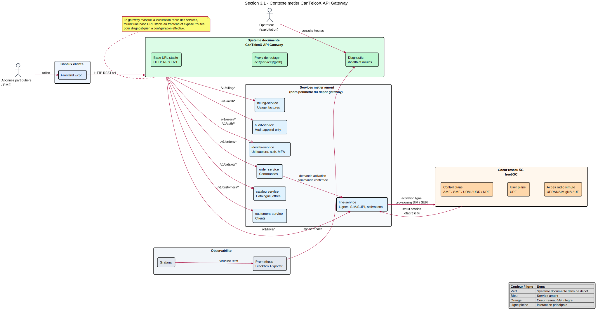

*Figure 3.1 — Contexte métier du gateway. Source PlantUML : `docs/diagrams/plantuml/contexte-metier-3-1.puml`.*

| **Partenaire** | **Direction** | **Protocole** | **Description** |
|----------------|---------------|---------------|-----------------|
| Frontend Expo | in | HTTPS / JSON | Application cliente qui consomme l’API REST `/v1` du gateway. |
| `identity-service` | out | HTTP REST / JSON | Gestion des utilisateurs, authentification et MFA via `/v1/users/*` et `/v1/auth/*`. |
| `order-service` | out | HTTP REST / JSON | Gestion des commandes via `/v1/orders/*`. |
| `line-service` | out | HTTP REST / JSON | Gestion des lignes, SIM/SUPI, activations et état réseau via `/v1/lines/*`. |
| `catalog-service` | out | HTTP REST / JSON | Consultation du catalogue et des offres via `/v1/catalog/*`. |
| `customers-service` | out | HTTP REST / JSON | Gestion des profils clients via `/v1/customers/*`. |
| `billing-service` | out | HTTP REST / JSON | Consultation de l’usage, des factures et des paiements via `/v1/billing/*`. |
| `audit-service` | out | HTTP REST / JSON | Journalisation des opérations sensibles via `/v1/audit/*`. |
| free5GC core | out | API / configuration réseau 5G | Coeur 5G de laboratoire utilisé par l’adapter d’activation de `line-service` pour provisionner les abonnés/SIM et vérifier l’état réseau. |
| Prometheus Blackbox Exporter | in | HTTP | Sonde l’endpoint `/health` du gateway pour l’observabilité. |
| Opérateur exploitation | in | HTTPS / JSON | Consulte `/health` et `/routes` pour diagnostiquer l’état du gateway et sa configuration de routage. |

## 3.2 Contexte technique

Systèmes externes simulés à intégrer via adapters (ports/adapters) :

| **Système externe simulé / intégré** | **Rôle**                       | **Protocole / adapter**          |
|--------------------------------------|--------------------------------|----------------------------------|
| free5GC core                         | Activation, provisionnement SIM/SUPI, état des sessions 5G | Adapter d’activation côté `line-service`; appels API/scripts selon l’environnement lab |
| UERANSIM gNB/UE                      | Accès radio et terminal 5G simulés pour valider l’attachement réseau | Scénarios de test raccordés au coeur free5GC |
| Hub de portabilité                   | Portabilité du numéro (MSISDN) | Adapter REST simulé à ajouter côté service lignes |
| Passerelle de paiement               | Paiement de facture (UC-06)    | Adapter REST simulé à ajouter côté service facturation |

## 3.3 Cartographie du domaine (DDD)

Bounded contexts du domaine télécom (frontières de service candidates) :

| **Bounded context**          | **Responsabilité**                            | **Service candidat**      |
|------------------------------|-----------------------------------------------|---------------------------|
| Clients & Identité           | Profils abonnés, vérification d’identité, MFA | `identity-service` |
| Lignes & Services            | Lignes / MSISDN, SIM/SUPI, activation, état réseau | `line-service` |
| Commandes & Activations      | Prise de commande, idempotence                | `order-service` |
| Catalogue & Offres           | Forfaits, options, éligibilité                | `catalog-service` |
| Usage / Rating / Facturation | Usage, rating, factures, exactly-once         | `billing-service` |
| Conformité & Audit           | Journal append-only, anti-fraude              | `audit-service` |

**Carte des contextes (relations : upstream/downstream, ACL, conformist…) :**

```text
Clients & Identité
  -> Commandes & Activations : client authentifié / profil vérifié
Catalogue & Offres
  -> Commandes & Activations : offres, forfaits, règles d'éligibilité
Commandes & Activations
  -> Lignes & Services : demande d'activation
Lignes & Services
  -> free5GC : provisionnement abonné/SIM, état réseau
Commandes & Activations
  -> Usage / Facturation : commande facturable
Usage / Facturation
  -> Conformité & Audit : paiement, facture, écritures sensibles
Tous les contextes
  -> Conformité & Audit : événements d'audit
```

Les relations sont volontairement dirigées des consommateurs vers les producteurs de capacité métier. Le gateway ne crée pas de dépendance métier circulaire : il route seulement les appels HTTP vers le contexte responsable. L’intégration free5GC est placée derrière un adapter de sortie du domaine d’activation : le BSS demande l’activation, mais ne dépend pas directement des composants AMF/SMF/UDM/UDR/UPF.

**Blocs DDD à matérialiser dans le code :** Ubiquitous Language (mêmes noms d’entités dans la doc, les diagrammes et le code), Value Objects (ex. ligne de commande sans identité propre hors de son agrégat), Aggregates (cohérence transactionnelle via commit/rollback), Repositories (masquage de la persistance, ségrégation lecture/écriture).

# 4. Stratégie de solution

> **Repères de l’énoncé**
>
> **Tâches de l’énoncé :** 2.1 Concevoir l’architecture microservices ; 2.2 Concevoir la couche API REST.
>
> **Vue 4+1 :** Transversale (préfigure §5–§7).
>
> **Livrables attendus :**
>
> - Choix de découpage en services (≥ 2) et style par service (Hexagonal/MVC).
> - Stratégie de communication inter-services (sync REST en Phase 1).
> - Routes versionnées /v1, codes HTTP normalisés, format d’erreur JSON unifié, contrats OpenAPI.

**Critères d’acceptation (à cocher)**

> ☐ Dépendances dirigées (pas de cycles), couplage contrôlé aux frameworks.
>
> ☐ Bounded contexts mappés sur les services.
>
> ☐ Swagger publié, collection Postman fonctionnelle, séparation domaine ↔ infra.

## 4.1 Style architectural & découpage en services

| **Décision**             | **Choix retenu**                                | **Justification (→ ADR)**          |
|--------------------------|-------------------------------------------------|------------------------------------|
| Style global             | Architecture basée par services (microservices) | ADR-0001 à compléter; déjà reflété dans le routage par service |
| Découpage (BC → service) | `identity-service`, `order-service`, `line-service`, `catalog-service`, `customers-service`, `billing-service`, `audit-service` | Alignement avec les bounded contexts DDD |
| Style par service        | Gateway en FastAPI/proxy; services métier cibles en hexagonal/ports-adapters | Le gateway reste une façade; la logique métier doit rester dans les services |

## 4.2 Communication inter-services

La Phase 1 utilise une communication synchrone HTTP REST. Le gateway reçoit les appels sous `/v1/{service}` et les relaie vers l’URL amont configurée par variable d’environnement. La méthode HTTP, le corps, le chemin et les paramètres de requête sont conservés; les headers hop-by-hop sont filtrés. Les dépendances métier restent dirigées vers le service responsable du bounded context appelé. Le gateway ne compose pas encore de transactions distribuées et ne porte pas de logique métier, ce qui limite les cycles.

## 4.3 Stratégie de l’API REST

| **Aspect**      | **Convention retenue**                                    |
|-----------------|-----------------------------------------------------------|
| Versionnement   | /v1/…                                                     |
| Codes HTTP      | Le gateway relaie les statuts amont; il produit `404` route inconnue, `503` service connu non configuré, `502` service amont indisponible. Les services métier doivent compléter `400/401/403/409/422/500`. |
| Format d’erreur | Actuel gateway : JSON `{"detail": "..."}` avec `upstream` et `reason` pour `502`. Format enrichi `code/message/traceId` à uniformiser. |
| Documentation   | OpenAPI/Swagger publié + collection Postman (Annexe A)    |

## 4.4 Référence industrielle TMF (optionnelle)

Les TMF Open APIs peuvent inspirer la conception. Mapping indicatif :

| **TMF Open API**        | **Domaine**             | **Service interne**       |
|-------------------------|-------------------------|---------------------------|
| TMF620 Product Catalog  | Catalogue & Offres      | `catalog-service` |
| TMF622 Product Ordering | Commandes & Activations | `order-service` |
| TMF629 Customer Mgmt    | Clients & Identité      | `identity-service` / `customers-service` |
| TMF666 Account Mgmt     | Facturation             | `billing-service` |

# 5. Vue des blocs de construction

> **Repères de l’énoncé**
>
> **Tâches de l’énoncé :** 1.2 modèle de domaine ; 2.1 couches & dépendances ; 4.1 domaine ; 4.2 ports/adapters.
>
> **Vue 4+1 :** Logique + Développement.
>
> **Livrables attendus :**
>
> - Décomposition en services et couches (hexagonal : domaine / application / infrastructure).
> - Modèle de domaine par service (entités, agrégats, value objects).
> - Organisation du code (structure des dépôts / modules).

**Critères d’acceptation (à cocher)**

> ☐ Agrégats clés identifiés (Profils abonnés, Lignes/MSISDN, Commandes, Forfaits, Factures).
>
> ☐ Séparation nette domaine ↔ infra ; pas de logique métier dans les controllers.

## 5.1 Niveau 1 — Whitebox du système global

Cette vue décompose le système en blocs principaux et précise, pour chacun, sa responsabilité et son interface principale. Le niveau 1 reste volontairement macroscopique : il montre les services visibles à l’échelle du système, sans détailler leur structure interne.

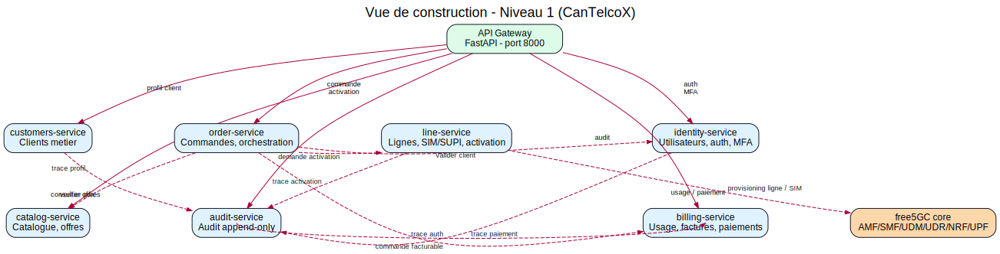

La vue de niveau 1 décompose le système en une façade d’entrée unique, `CanTelcoX API Gateway`, et plusieurs services métier amont alignés sur les bounded contexts du domaine télécom. Le gateway est le seul bloc implémenté dans ce dépôt : il expose les routes publiques, résout le service cible à partir du segment `/v1/{service}`, puis relaie la requête HTTP vers l’URL amont configurée. Les services métier conservent la responsabilité de leurs règles, de leur persistance et de leurs contrats internes.

Les dépendances sont dirigées du client vers le gateway, puis du gateway vers les services responsables. Aucun service métier ne dépend du gateway pour exécuter sa logique interne; le gateway agit comme adaptateur d’entrée et point de routage, pas comme orchestrateur métier.

| Bloc | Responsabilité | Interface principale |
|------|----------------|----------------------|
| `CanTelcoX API Gateway` | Routage `/v1/*`, diagnostic `/health` et `/routes`, filtrage des headers hop-by-hop, gestion des erreurs de disponibilité amont (`404`, `503`, `502`) | HTTP REST public, port `8000` |
| `identity-service` | Utilisateurs, authentification, MFA et identité numérique | HTTP REST interne via `/v1/users/*` et `/v1/auth/*`, port `8020` |
| `order-service` | Commandes, demandes d’activation et idempotence métier | HTTP REST interne via `/v1/orders/*`, port `8030` |
| `line-service` | Lignes mobiles, MSISDN, SIM/SUPI, activation et état réseau | HTTP REST interne via `/v1/lines/*`, port `8080` |
| `catalog-service` | Catalogue des offres, forfaits, options et règles d’éligibilité | HTTP REST interne via `/v1/catalog/*`, port `8040` |
| `customers-service` | Client métier distinct de l’identité numérique | HTTP REST interne via `/v1/customers/*` ; service prévu, URL à configurer |
| `billing-service` | Usage, factures, paiements et écritures de facturation | HTTP REST interne via `/v1/billing/*` ; service prévu, URL à configurer |
| `audit-service` | Journalisation append-only, traces des opérations sensibles et support anti-fraude | HTTP REST interne via `/v1/audit/*` ; service prévu, URL à configurer |
| `free5GC core` | Provisionnement réseau 5G, attachement UE/gNB simulé et état des sessions réseau | Interface technique appelée par l’adapter d’activation de `line-service`; hors routage public du gateway |

La configuration maintient le couplage faible entre le gateway et les services : `IDENTITY_SERVICE_URL`, `ORDER_SERVICE_URL`, `CATALOG_SERVICE_URL`, `CUSTOMERS_SERVICE_URL`, `BILLING_SERVICE_URL` et `AUDIT_SERVICE_URL` peuvent changer sans modifier le code applicatif. Quand une famille de routes est connue mais que son URL est vide, le gateway retourne `503`; quand l’URL existe mais que le service ne répond pas, il retourne `502`.

## 5.2 Niveau 2 — Structure interne d’un service (hexagonal)

Le niveau 2 zoome sur les blocs critiques de la vue 5.1. Les services métier suivent une cible **hexagonale** : adapters d’entrée, couche application, domaine pur, adapters de sortie. Le gateway fait exception : il reste une façade technique de routage et ne contient pas de domaine métier.

### 5.2.1 Whitebox de l’API Gateway

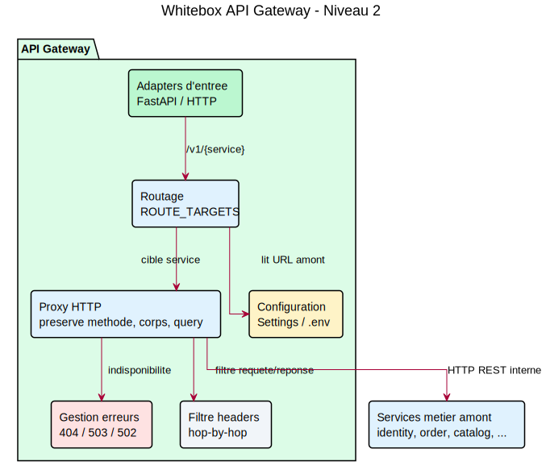

*Source PlantUML : [`api-gateway-5-2.puml`](diagrams/plantuml/level2/api-gateway-5-2.puml).*

- **Responsabilité** : exposer `/health`, `/routes` et `/v1/*`, résoudre la cible amont et relayer les requêtes.
- **Ports primaires** : HTTP public FastAPI.
- **Ports secondaires** : URLs `*_SERVICE_URL` vers les services métier.
- **Invariant** : aucune règle métier ni persistance métier dans le gateway.

### 5.2.2 Whitebox de `identity-service`

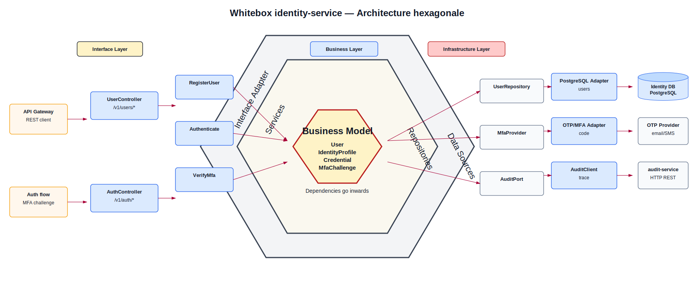

*Diagramme SVG : `diagrams/plantuml/level2/identity-service-5-2.svg`.*

- **Domaine** : `User`, `IdentityProfile`, `Credential`, `MfaChallenge`.
- **Ports primaires** : `UserController`, `AuthController`.
- **Ports secondaires** : `UserRepository`, fournisseur OTP/MFA, `AuditClient`.
- **Invariants métier** : identifiants uniques, MFA validé avant les opérations sensibles, tentatives d’authentification traçables.

### 5.2.3 Whitebox de `order-service`

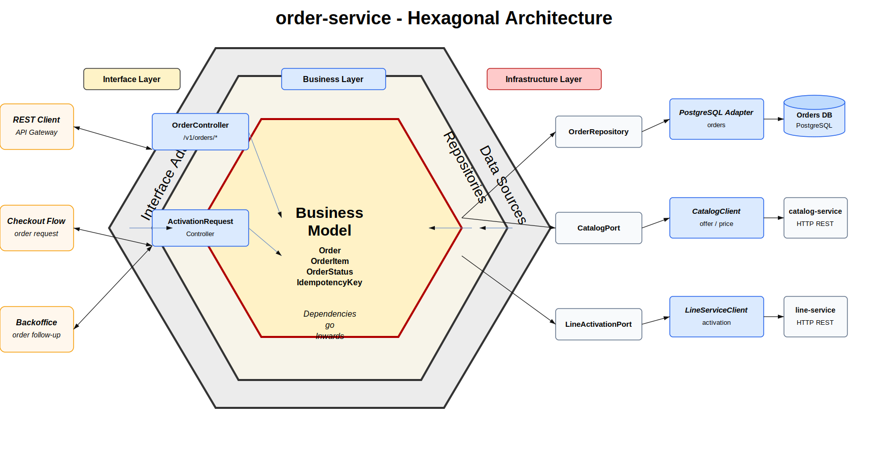

*Diagramme SVG : `diagrams/plantuml/level2/order-service-5-2.svg`.*

- **Domaine** : `Order`, `OrderItem`, `IdempotencyKey`.
- **Ports primaires** : `OrderController`, `ActivationRequestController`.
- **Ports secondaires** : `OrderRepository`, `CatalogClient`, `IdentityClient`, `BillingClient`, `AuditClient`, `LineActivationPort`.
- **Invariants métier** : une clé d’idempotence ne crée qu’une commande logique, statut de commande contrôlé, offre vérifiée avant demande d’activation, aucun appel direct à free5GC.

### 5.2.4 Whitebox de `line-service`


*Diagramme SVG : `diagrams/plantuml/level2/line-service-5-2.svg`.*

- **Domaine** : `MobileLine`, `SimProfile`, `NetworkSession`, `ActivationRequest`.
- **Ports primaires** : `LineController`, `LineActivationController`.
- **Ports secondaires** : `LineRepository`, `Free5gcPort`, `AuditPort`, `IdentityPort`.
- **Invariants métier** : MSISDN/SUPI uniques, activation idempotente, passage à `ACTIVE` seulement après confirmation free5GC ou simulation documentée.

### 5.2.5 Whitebox de `catalog-service`

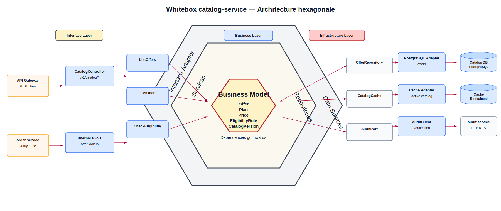

*Diagramme SVG : `diagrams/plantuml/level2/catalog-service-5-2.svg`.*

- **Domaine** : `Offer`, `Plan`, `Price`, `EligibilityRule`, `CatalogVersion`.
- **Ports primaires** : `CatalogController`.
- **Ports secondaires** : `OfferRepository`, cache catalogue, `AuditClient`.
- **Invariants métier** : catalogue versionné, offre active pour être vendue, prix et règles d’éligibilité cohérents avec la version.

### 5.2.6 Whitebox de `customers-service`

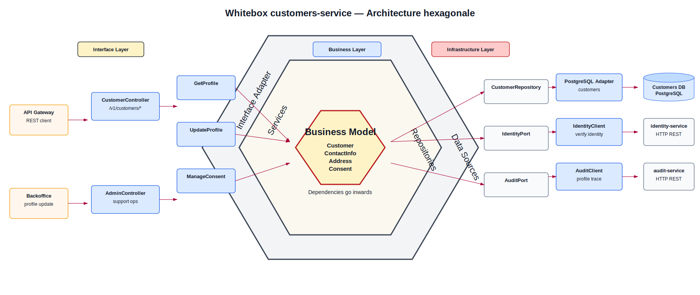

*Diagramme SVG : `diagrams/plantuml/level2/customers-service-5-2.svg`.*

- **Domaine** : `Customer`, `ContactInfo`, `Address`, `Consent`.
- **Ports primaires** : `CustomerController`.
- **Ports secondaires** : `CustomerRepository`, `IdentityClient`, `AuditClient`.
- **Invariants métier** : le client métier est distinct de l’identité numérique, tout changement sensible de profil est auditable.

### 5.2.7 Whitebox de `billing-service`

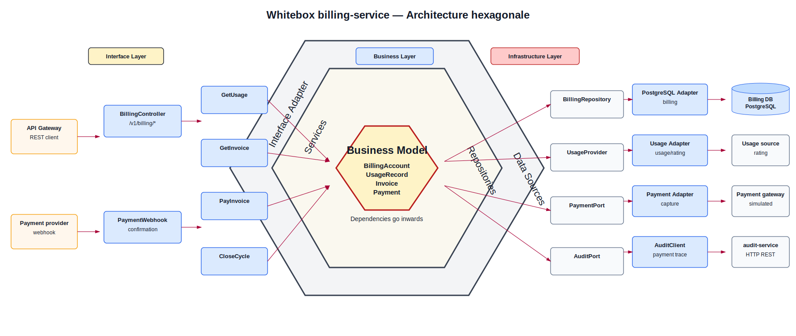

*Diagramme SVG : `diagrams/plantuml/level2/billing-service-5-2.svg`.*

- **Domaine** : `BillingAccount`, `UsageRecord`, `Invoice`, `Payment`.
- **Ports primaires** : `BillingController`, `PaymentWebhook`.
- **Ports secondaires** : `BillingRepository`, `UsageProvider`, passerelle de paiement, `AuditClient`.
- **Invariants métier** : paiement appliqué une seule fois, facture rattachée à une période, écriture de facturation exactly-once.

### 5.2.8 Whitebox de `audit-service`

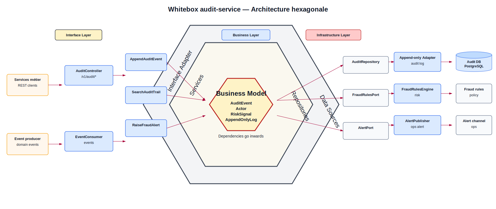

*Diagramme SVG : `diagrams/plantuml/level2/audit-service-5-2.svg`.*

- **Domaine** : `AuditEvent`, `Actor`, `RiskSignal`, `AppendOnlyLog`.
- **Ports primaires** : `AuditController`, consommateur d’événements de domaine.
- **Ports secondaires** : repository append-only, moteur de règles fraude, publication d’alertes.
- **Invariants métier** : journal en insertion seule, horodatage et acteur obligatoires, événements sensibles conservés pour audit et fraude.

## 5.3 Modèle de domaine (vue logique 4+1)

Le diagramme suivant présente les principales abstractions du domaine CanTelcoX, indépendamment de l’implémentation technique. Il relie les agrégats métier utilisés par les services de la vue 5.2 : identité, client, lignes mobiles, catalogue, commandes, facturation et audit.


*Source PlantUML : [`domain-model-5-3.puml`](diagrams/plantuml/domain-model-5-3.puml).*

| **Agrégat racine** | **Entités / Value Objects principaux** | **Service responsable** | **Invariants métier** |
|--------------------|----------------------------------------|-------------------------|------------------------|
| `IdentityAccount` | `Credential`, MFA | `identity-service` | Identifiant unique; MFA requis pour les opérations sensibles; compte verrouillable après échecs répétés. |
| `Customer` | `ContactInfo`, `Address`, `Consent` | `customers-service` | Client métier distinct de l’identité numérique; consentements et changements sensibles auditables. |
| `MobileLine` | `MSISDN`, `SimProfile`, `NetworkSession`, offre souscrite | `line-service` | MSISDN/SUPI uniques; activation contrôlée; une ligne active référence une offre admissible et un profil réseau provisionné dans free5GC. |
| `Offer` | `Plan`, `Price`, `EligibilityRule`, version de catalogue | `catalog-service` | Offre active pour être vendue; prix et règles cohérents avec la version référencée par la commande. |
| `Order` | `OrderItem`, `IdempotencyKey` | `order-service` | Une clé d’idempotence ne produit qu’un effet métier; une commande référence une offre versionnée. |
| `Invoice` | `UsageRecord`, `Payment` | `billing-service` | Facture rattachée à une période; paiement appliqué une seule fois; écriture de facturation exactly-once. |
| `AuditEvent` | `Actor`, `RiskSignal`, journal append-only | `audit-service` | Événement horodaté et associé à un acteur; insertion seule; opérations sensibles conservées pour audit et fraude. |

## 5.4 Organisation du code (vue Développement)

Arborescence actuelle du dépôt gateway :

```text
app/
  main.py              # application FastAPI et proxy HTTP
  core/config.py       # configuration par variables d'environnement
Dockerfile             # image Python 3.12 / Uvicorn
docker-compose.yml     # lancement du gateway en network_mode host
requirements.txt       # dépendances Python
docs/arc42/            # documentation Arc42 modulaire
docs/adr/              # décisions d'architecture
```

Les dépendances sont simples : `main.py` dépend de `settings`, mais le module de configuration ne dépend pas de l’application. Les services métier amont sont externes à ce dépôt.

# 6. Vue d’exécution

> **Repères de l’énoncé**
>
> **Tâches de l’énoncé :** 4.3 Exposer l’API REST publique (scénario bout-en-bout) ; 3.2 idempotence à l’exécution.
>
> **Vue 4+1 :** Processus (C&C).
>
> **Livrables attendus :**
>
> - Diagrammes de séquence pour les scénarios clés.
> - Scénario E2E : inscription → MFA → activation ligne → souscription forfait → consultation usage.

**Critères d’acceptation (à cocher)**

> ☐ Scénario bout-en-bout démontrable dans la VM, erreurs normalisées JSON.
>
> ☐ Double soumission d’une commande sans effet de bord (idempotence) illustrée.

## 6.1 Scénario bout-en-bout (E2E)

Ce scénario nominal illustre le parcours principal attendu : inscription du client, validation MFA, consultation du catalogue, création d’une commande avec idempotence, activation/facturation, puis consultation de l’usage. Il montre la vue processus 4+1 : ordre des appels, synchronisation HTTP et responsabilités runtime.


*Source PlantUML : [`runtime-e2e-6-1.puml`](diagrams/plantuml/runtime-e2e-6-1.puml).*

**Préconditions :**

- Les URLs `IDENTITY_SERVICE_URL`, `CATALOG_SERVICE_URL`, `ORDER_SERVICE_URL`, `BILLING_SERVICE_URL` et `AUDIT_SERVICE_URL` sont configurées.
- L’adapter free5GC de `line-service` est configuré avec l’adresse du coeur 5G de laboratoire et les paramètres réseau nécessaires (SUPI/SIM, DNN, slice).
- Le client peut joindre l’API Gateway.
- Les services amont exposent les endpoints métier illustrés.

**Points d’attention runtime :**

- Le gateway relaie les appels sans porter la logique métier.
- `order-service` conserve la clé `Idempotency-Key` pour éviter une double création de commande.
- L’appel free5GC reste interne à `line-service`; le client, le gateway et `order-service` ne manipulent pas directement les fonctions réseau 5G.
- Les opérations sensibles sont tracées par `audit-service`.
- La consultation d’usage dépend de `billing-service`, qui reste à configurer dans le MVP actuel.

## 6.2 Authentification & MFA (UC-02)

```text
Client -> Gateway: POST /v1/auth/mfa/challenge
Gateway -> identity-service: POST /v1/auth/mfa/challenge
identity-service -> Gateway: challenge créé
Client -> Gateway: POST /v1/auth/mfa/verify
Gateway -> identity-service: POST /v1/auth/mfa/verify
identity-service -> Gateway: résultat MFA
```

Le gateway relaie la séquence; la génération OTP, la validation MFA et les refus métier restent la responsabilité de `identity-service`.

## 6.3 Idempotence & exactly-once à l’exécution

```text
Client -> Gateway: POST /v1/orders avec Idempotency-Key: K
Gateway -> order-service: POST /v1/orders avec Idempotency-Key: K
order-service -> Gateway: 201 commande créée

Client -> Gateway: POST /v1/orders avec Idempotency-Key: K
Gateway -> order-service: POST /v1/orders avec Idempotency-Key: K
order-service -> Gateway: même résultat logique, sans nouvelle commande
```

Le gateway préserve les headers applicatifs, donc il peut transporter `Idempotency-Key`. La déduplication effective doit être implémentée et testée dans `order-service` et `billing-service`.

# 7. Vue de déploiement

> **Repères de l’énoncé**
>
> **Tâches de l’énoncé :** 8.1 conteneurisation ; 6.1 API Gateway ; 5.3 load balancing.
>
> **Vue 4+1 :** Déploiement.
>
> **Livrables attendus :**
>
> - Topologie docker-compose : services + DB + Prometheus + Grafana + Gateway + cache + seed ; healthchecks /health.
> - API Gateway (Kong/KrakenD/Spring Cloud Gateway) : routage, en-têtes/clé API, CORS, throttling.
> - Load balancing (NGINX/HAProxy/Traefik) pour N = 1..4 instances.

**Critères d’acceptation (à cocher)**

> ☐ docker compose up lance l’ensemble ; healthchecks OK.
>
> ☐ Appels fonctionnels via la Gateway ; configuration versionnée.

## 7.1 Topologie de déploiement

```text
Machine gateway
  docker-compose.yml
    api-gateway
      image construite depuis Dockerfile
      network_mode: host
      env_file: .env
      port applicatif: 8000

Tailnet / VM-LXC
  identity-service  http://100.83.57.43:8020
  order-service     http://100.108.225.1:8030
  line-service      http://100.86.218.1:8080
  catalog-service   http://100.95.65.46:8040
  customers-service http://100.99.167.126:8050
  billing-service   http://100.114.185.38:8060
  audit-service     http://100.94.161.70:8070
  free5gc-core      adresse Tailnet/LXC à renseigner
  observability     http://100.87.177.66
```

Le mode `host` permet au conteneur gateway d’utiliser la connectivité réseau de la machine hôte, notamment vers Tailscale/Tailnet.
Les services métier sont maintenus dans des dépôts GitHub séparés et déployés sur des VM/LXC distinctes. Les conteneurs `line-service`, `customers-service`, `billing-service` et `audit-service` sont présents sur le Tailnet; côté dépôt gateway, les URLs amont et les routes sont configurées ou préparées pour les joindre sur les ports indiqués.
Le coeur free5GC est déployé comme voisin réseau spécialisé : il n’est pas exposé par le gateway public, mais consommé par l’adapter d’activation de `line-service` pour provisionner les informations SIM/SUPI/DNN/slice et vérifier l’attachement 5G en laboratoire.

## 7.2 API Gateway

| **Capacité Gateway**           | **Configuration**                                        |
|--------------------------------|----------------------------------------------------------|
| Routage dynamique              | Table `ROUTE_TARGETS` : `users/auth`, `orders`, `lines`, `catalog`, `customers`, `billing`, `audit` |
| En-têtes / clé API             | Headers transmis sauf hop-by-hop; clé API/rate limiting à ajouter |
| CORS                           | Regex locale : `localhost`, `127.0.0.1`, `10.0.2.2`, `192.168.x.x` |
| Produit retenu                 | Gateway maison FastAPI, point d’entrée unique des appels API |
| Timeout                        | `urlopen(..., timeout=15)` |
| Throttling / quota (optionnel) | Non implémenté à ce stade |

## 7.3 Load balancing & tolérance aux pannes

Le load balancing est implémenté comme **patron d'infrastructure réplicable** et démontré sur `catalog-service`, choisi comme service pilote parce qu'il est principalement en lecture et se prête bien aux tests de charge. L'objectif n'est pas de dupliquer immédiatement HAProxy devant tous les services, mais de prouver le mécanisme exigé par le cahier : N = 1..4 instances, comparaison latence/RPS/erreurs/saturation et tolérance aux pannes par kill d'instance.

Première tranche implémentée pour `catalog-service` avec HAProxy, sans modifier la logique applicative du gateway. Le gateway continue de router vers une URL par service; pour le catalogue, cette URL peut maintenant pointer vers `http://127.0.0.1:18040`, où HAProxy distribue les appels vers les instances `catalog-service`.

Éléments ajoutés au dépôt :

- `infra/load-balancer/haproxy/catalog.cfg` : frontend HAProxy sur `127.0.0.1:18040`, backend `catalog_backend`, stratégie `roundrobin`, health check `GET /health`.
- `docker-compose.yml` : service `catalog-load-balancer` activable avec le profil Compose `load-balancing`.
- `tests/load/catalog-through-gateway.js` : script k6 initial pour mesurer les appels catalogue via le gateway.

Le backend HAProxy contient l’instance actuelle `100.95.65.46:8040` et des lignes préparées pour `catalog-2` à `catalog-4`. Les mesures N = 1..4, le kill d’instance en charge et les résultats chiffrés restent à produire au §10.6. Le même patron peut être appliqué aux autres services en ajoutant un backend HAProxy dédié et en remplaçant l'URL amont correspondante (`ORDER_SERVICE_URL`, `BILLING_SERVICE_URL`, etc.) par l'adresse du load balancer du service.

# 8. Concepts transversaux

> **Repères de l’énoncé**
>
> **Tâches de l’énoncé :** 3.1–3.2 persistance & intégrité ; 4.4 / 7.2 sécurité ; 5.1 observabilité ; 5.4 caching.
>
> **Livrables attendus :**
>
> - Schéma de persistance par service (ORM/DAO), contraintes d’intégrité, migrations, seeds.
> - Idempotence (idempotency-key), exactly-once (facturation), journal d’audit append-only.
> - Sécurité : CORS, Basic/JWT, MFA/OTP, validation, secrets via variables d’environnement.
> - Observabilité : logs structurés, métriques Prometheus, dashboards Grafana (4 Golden Signals).
> - Caching (mémoire/Redis) sur endpoints coûteux + règles d’invalidation.

**Critères d’acceptation (à cocher)**

> ☐ CRUD robuste, rollback sur erreur, double soumission sans effet de bord.
>
> ☐ Garantie exactly-once sur écritures de facturation ; journal append-only opérationnel.
>
> ☐ Aucun secret en clair ; MFA fonctionnel sur UC-02 et UC-03.
>
> ☐ 4 Golden Signals observés (P95/P99, RPS, 4xx/5xx, saturation).
>
> ☐ Gains de cache chiffrés (latence, charge DB) + stratégie d’invalidation.

## 8.1 Persistance & intégrité

Le gateway ne possède pas de persistance métier. Il est stateless et lit sa configuration au démarrage via variables d’environnement. Les services métier utilisent chacun une base **PostgreSQL** dédiée (`identity-service`, `order-service`, `catalog-service`, `customers-service`, `billing-service`, `audit-service`). Les choix ORM/DAO, transactions, contraintes d’unicité et migrations doivent être documentés par service. La stratégie cible est **database per service** afin d’éviter le couplage par base partagée.

## 8.2 Idempotence (commandes & activations)

Le gateway préserve les headers applicatifs et peut donc transporter une `Idempotency-Key` vers `order-service` pour les commandes ou `line-service` pour les activations. La portée cible est par client, route et opération sensible, avec stockage côté service applicatif. Le comportement attendu est de retourner le résultat logique déjà produit lors d’une double soumission, sans créer de nouvelle commande ou activation. Le stockage, la fenêtre de rejeu et les tests restent à implémenter côté service métier.

## 8.3 Exactly-once (facturation)

La garantie exactly-once n’est pas implémentée dans le gateway. Elle doit être portée par `billing-service`, par exemple avec une clé de déduplication, une contrainte unique sur l’écriture de facturation, une transaction locale et éventuellement un pattern outbox si des événements sont publiés.

## 8.4 Journal d’audit append-only (CRTC / Loi 25)

Le gateway prépare la famille de routes `/v1/audit/*` vers `audit-service`. Le journal append-only doit consigner les opérations sensibles : authentification/MFA, activation de ligne, commande, paiement, fraude suspectée et accès aux données personnelles. La garantie d’immutabilité reste à implémenter côté audit, idéalement par insertion seule, interdiction d’update/delete applicatifs, horodatage, acteur, trace/correlation id et empreinte de chaîne ou mécanisme équivalent.

## 8.5 Sécurité applicative

| **Mécanisme**               | **Mise en œuvre**                                       |
|-----------------------------|---------------------------------------------------------|
| Authentification            | À finaliser dans `identity-service`; le gateway relaie actuellement les routes `/v1/auth/*` |
| MFA / OTP                   | À finaliser dans `identity-service`; requis pour UC-02 et opérations sensibles UC-03 |
| CORS                        | Middleware FastAPI autorisant les origines locales de développement |
| Validation / assainissement | Validation métier à faire dans les services; le gateway conserve le corps et relaie |
| Gestion des secrets         | Variables d’environnement (aucun secret en clair)       |

## 8.6 Contrôles anti-fraude

Non implémenté dans le gateway. Les règles attendues sont : détection SIM swap, incohérence d’identité, changement suspect de coordonnées, usage roaming anormal, paiement répété ou refusé, et activation répétée. Les alertes doivent être reliées à `audit-service` et testées par scénarios négatifs.

## 8.7 Gestion d’erreurs & versionnement

Le versionnement `/v1` est en place. Le gateway retourne `404` pour une famille de route inconnue, `503` pour une famille connue sans URL amont et `502` si le service amont configuré est indisponible. Les erreurs des services amont sont relayées telles quelles. Il reste à normaliser tous les services sur un format commun, par exemple `code`, `message`, `details`, `traceId`, `timestamp`.

## 8.8 Observabilité (4 Golden Signals)

| **Golden Signal** | **Métrique**        | **Cible**                 |
|-------------------|---------------------|---------------------------|
| Latence           | `api_gateway_http_request_duration_seconds` + `probe_duration_seconds` | P95 ≤ 500 ms |
| Trafic            | `api_gateway_http_requests_total` | ≥ 600 ops/s |
| Erreurs           | `api_gateway_http_requests_total{status=~"4..|5.."}` | Seuil cible recommandé < 1 % hors tests négatifs |
| Saturation        | `api_gateway_http_requests_in_progress`, métriques `process_*`, Node Exporter | Seuil cible recommandé < 80 % CPU/RAM en nominal |

Le gateway expose maintenant `/metrics` au format Prometheus et journalise les requêtes en JSON avec `trace_id`, méthode, chemin, route, statut, durée et client. Le header `X-Trace-Id` est retourné au client et propagé vers le service amont. Les métriques applicatives du gateway sont visibles dans Grafana via `api_gateway_http_requests_total`, `api_gateway_http_request_duration_seconds` et `api_gateway_http_requests_in_progress`.

Les captures Grafana produites le 2026-06-30 confirment les quatre signaux sur la fenêtre observée : latence P95/P99 des sondes `/health`, disponibilité `UP` des services supervisés, trafic applicatif du gateway, erreurs 4xx/5xx générées par scénario négatif, et saturation CPU/RAM/réseau de services. Le détail et les figures sont intégrés au §10.5.

## 8.9 Caching

Non implémenté dans le gateway actuel. Candidats : catalogue de forfaits (`/v1/catalog/*`) et lectures d’usage/factures (`/v1/billing/*`) si la fraîcheur métier le permet. Il faudra définir TTL, invalidation sur modification catalogue ou nouvelle écriture de facturation, puis mesurer les gains au §10.7.

# 9. Décisions d’architecture (ADR)

> **Repères de l’énoncé**
>
> **Tâches de l’énoncé :** 2.4 Consigner les décisions structurantes (≥ 3 ADR).
>
> **Livrables attendus :**
>
> - ADR-001 — Style architectural & découpage en services.
> - ADR-002 — Persistance & transactions (idempotence / exactly-once / journal append-only — conformité CRTC/Loi 25).
> - ADR-003 — Stratégie d’erreurs & versionnement d’API.

**Critères d’acceptation (à cocher)**

> ☐ Format ADR complet (statut, contexte, décision, conséquences).
>
> ☐ Chaque ADR explicitement traçable à une exigence du cahier.

## ADR-001 — Style architectural & découpage en services

|                               |                                                                  |
|-------------------------------|------------------------------------------------------------------|
| **Statut**                    | À compléter dans `docs/adr/0001-architecture-microservices.md` |
| **Contexte**                  | BSS télécom découpé par domaines; services déployables indépendamment; gateway comme façade unique |
| **Décision**                  | Architecture microservices routée par API Gateway, services alignés sur les bounded contexts |
| **Conséquences**              | Évolution indépendante des services, configuration réseau explicite; complexité réseau et observabilité distribuée à gérer |
| **Exigence du cahier tracée** | Tâche 2.1, documentation 4+1/Arc42, découpage par bounded contexts |

## ADR-002 — Persistance & transactions (idempotence / exactly-once / append-only)

|                               |                                                             |
|-------------------------------|-------------------------------------------------------------|
| **Statut**                    | À compléter dans `docs/adr/0004-idempotence-audit-billing.md` |
| **Contexte**                  | Commandes, activations, paiements et facturation ne doivent pas produire de doublons; audit requis pour conformité |
| **Décision**                  | Idempotence côté commandes/activations, exactly-once côté facturation, journal append-only côté audit |
| **Conséquences**              | Besoin de contraintes uniques, transactions locales, clés de déduplication et tests de rejeu |
| **Exigence du cahier tracée** | Tâche 3.2, conformité CRTC / Loi 25, UC-05/06/08 |

## ADR-003 — Stratégie d’erreurs & versionnement d’API

|                               |                                                      |
|-------------------------------|------------------------------------------------------|
| **Statut**                    | Proposé; à créer ou compléter dans un ADR dédié |
| **Contexte**                  | Les clients doivent recevoir des erreurs cohérentes malgré plusieurs services amont |
| **Décision**                  | Routes versionnées `/v1`; codes HTTP normalisés; JSON d’erreur commun à généraliser |
| **Conséquences**              | Diagnostic plus simple et tests E2E plus stables; nécessite adaptation de tous les services |
| **Exigence du cahier tracée** | Tâche 2.2, §8.7, Annexe A |

*Ajoutez un ADR-004 (et suivants) au besoin, en réutilisant le même tableau.*

# 10. Exigences de qualité

> **Repères de l’énoncé**
>
> **Tâches de l’énoncé :** 5.2 tests de charge ; 5.3 load balancing ; 5.4 caching ; 6.2 direct vs Gateway ; 7.1 stratégie de tests.
>
> **Vue 4+1 :** Scénarios.
>
> **Livrables attendus :**
>
> - Arbre de qualité + scénarios de qualité mesurables.
> - Cibles NFR et stratégie de tests (pyramide unit → intégration → E2E).
> - Plans de campagnes de charge (UC-03/04/05/08) et de comparaison (N=1..4, cache, Gateway).

**Critères d’acceptation (à cocher)**

> ☐ Paliers NFR cibles atteints (ou écarts argumentés) : P95 ≤ 500 ms, ≥ 600 ops/s, dispo 95 %.
>
> ☐ Couverture ≥ 80 % sur le domaine critique ; ≥ 1 scénario E2E via la Gateway.

## 10.1 Arbre de qualité

| **Priorité** | **Attribut** | **Objectif** | **Mécanisme actuel / cible** |
|--------------|--------------|--------------|-------------------------------|
| 1 | Déployabilité | Lancer le gateway rapidement en laboratoire | Dockerfile, Docker Compose, variables d’environnement |
| 2 | Maintenabilité | Changer une URL amont sans modifier le code | `Settings` Pydantic et table de routage |
| 3 | Disponibilité | Diagnostiquer un service indisponible | `/health`, `/routes`, erreurs `502/503` |
| 4 | Observabilité | Suivre santé et signaux applicatifs | Blackbox Exporter existant; `/metrics` gateway ajouté |
| 5 | Sécurité/auditabilité | Protéger opérations sensibles | CORS local en place; auth/MFA/audit à finaliser |
| 6 | Intégration réseau 5G | Activer une ligne et vérifier l’état réseau | Adapter free5GC côté `line-service`; scénario E2E à instrumenter |

## 10.2 Scénarios de qualité

| **Attribut**              | **Stimulus**                                | **Réponse attendue / mesure**     |
|---------------------------|---------------------------------------------|-----------------------------------|
| Performance               | Consultation usage à cadence élevée (UC-04) | P95 ≤ 500 ms                      |
| Capacité                  | Montée en charge                            | ≥ 600 ops/s avant saturation      |
| Disponibilité             | Kill d’une instance en charge               | Maintien de 95 % de disponibilité |
| Sécurité                  | Opération sensible sans MFA                 | Refus + journalisation            |
| Intégration free5GC       | Activation d’une ligne après commande       | Profil SIM/SUPI provisionné; état réseau retourné ou erreur explicite |
| Maintenabilité            | Changement d’adresse `identity-service`     | Mise à jour `.env` sans changement de code |

## 10.3 Cibles NFR & résultats

| **Indicateur** | **Cible**   | **Mesuré**            | **Verdict**                   |
|----------------|-------------|-----------------------|-------------------------------|
| Latence P95    | ≤ 500 ms    | P95 gateway `/health` : 6,01 ms; P95 catalog : 4,44 ms; P95 identity : 5,40 ms; P95 order : 5,84 ms | Atteint sur les sondes `/health` observées |
| Débit          | ≥ 600 ops/s | Dernière valeur Grafana gateway : 3,64 req/s; campagne k6 catalogue via gateway : 19,46 req/s | Non atteint / non testé jusqu'au seuil cible |
| Disponibilité  | 95 %        | `api-gateway`, `catalog-service`, `order-service` et `identity-service` affichés `UP` | Atteint sur la fenêtre de capture |

Synthèse : la latence et la disponibilité observées sont conformes aux cibles sur la fenêtre mesurée. Le débit de 600 ops/s n'est pas démontré par les captures actuelles; les campagnes de charge plus poussées restent à produire pour conclure sur la capacité maximale. Le détail des mesures et les captures figurent aux §10.5 à §10.8.

## 10.4 Stratégie de tests & couverture

Stratégie cible : tests unitaires du routage et de la configuration gateway, tests d’intégration avec services amont simulés, tests E2E via le gateway pour inscription/MFA/commande/catalogue/facturation, puis tests de charge sur les UC critiques. Le dépôt actuel ne contient pas encore de suite de tests automatisés.

*Couverture mesurée sur le domaine critique : non mesurée (cible ≥ 80 %).*

## 10.5 Résultats des campagnes de charge

Scénarios k6/JMeter/Artillery — stress progressif jusqu’au seuil de saturation :

| **Scénario de charge**       | **Charge nominale**   | **Seuil de saturation** | **P95**               |
|------------------------------|-----------------------|-------------------------|-----------------------|
| UC-04 — Consultation usage   | Non mesuré | Non mesuré | Non mesuré |
| UC-05 — Prise de commande    | Non mesuré | Non mesuré | Non mesuré |
| UC-03 — Activation           | Non mesuré | Non mesuré | Non mesuré |
| UC-02 — Authentification MFA | Non mesuré | Non mesuré | Non mesuré |
| UC-08 — Facturation          | Non mesuré | Non mesuré | Non mesuré |

### 10.5.1 Campagne k6 catalogue via gateway

La première campagne de charge exploitable porte sur le trajet `client -> api-gateway -> catalog-service`, avec 20 utilisateurs virtuels pendant 1 minute sur `/v1/catalog/plans`.

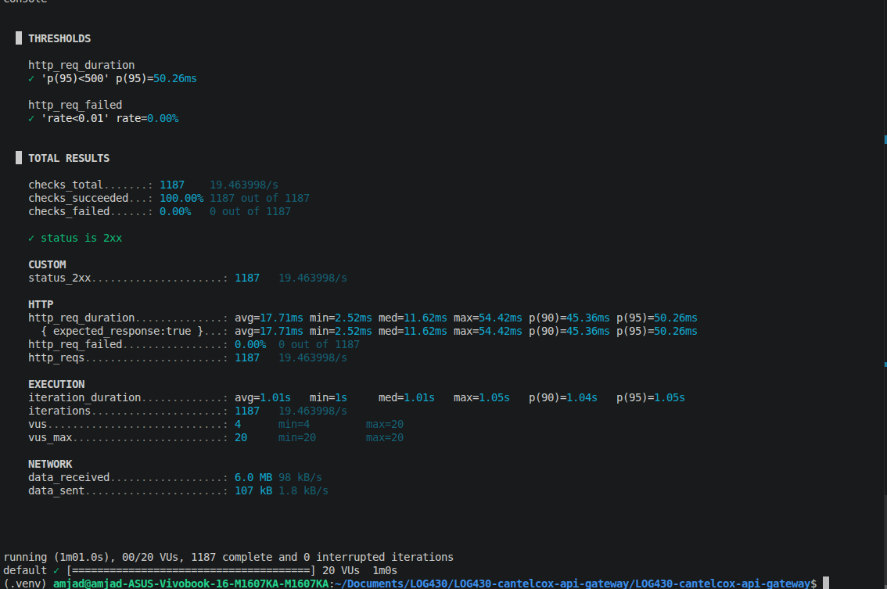

**Figure 10.5-0 — Résultat k6 catalogue via gateway.** Le test termine sans interruption : 1187 requêtes, 19,46 req/s, 100 % de checks réussis, 0,00 % d'erreurs HTTP, durée moyenne 17,71 ms, P90 45,36 ms, P95 50,26 ms et maximum 54,42 ms. Les seuils k6 configurés sont respectés (`p(95)<500` et `http_req_failed<1 %`).

| **Campagne** | **Charge** | **Requêtes** | **RPS** | **P90** | **P95** | **Max** | **Erreurs** | **Verdict** |
|--------------|------------|--------------|---------|---------|---------|---------|-------------|-------------|
| Catalogue via gateway | 20 VUs, 1 min | 1187 | 19,46 req/s | 45,36 ms | 50,26 ms | 54,42 ms | 0,00 % | Latence conforme; capacité 600 ops/s non démontrée |

Cette campagne valide le bon comportement du gateway sous une charge modérée et fournit une preuve chiffrée pour la latence applicative. Elle ne constitue pas encore un test de saturation : il faudra augmenter progressivement le nombre de VUs ou le taux d'arrivée pour établir le seuil de capacité réel.

### 10.5.2 Observabilité Grafana - 4 Golden Signals

Les captures suivantes proviennent de Prometheus et du dashboard Grafana "CanTelcoX Observabilite applicative et infra". Elles constituent les preuves d'observabilité de la Phase 1 et complètent les campagnes de charge k6 : elles montrent le scrape `/metrics`, l'état des sondes, les métriques gateway et la saturation de quelques services raccordés.

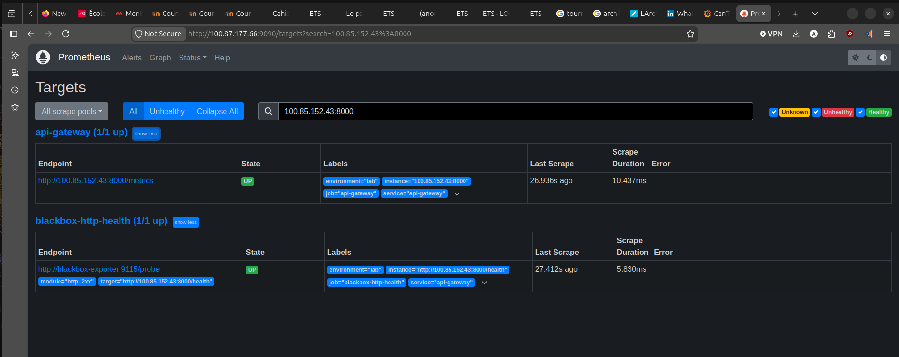

**Figure 10.5-1 — Prometheus Targets gateway.** Prometheus scrape directement `http://100.85.152.43:8000/metrics` avec l'état `UP` pour le job `api-gateway`. La sonde Blackbox HTTP vérifie aussi `http://100.85.152.43:8000/health` avec l'état `UP`. Les durées visibles sont de 10,437 ms pour le scrape `/metrics` et 5,830 ms pour la sonde `/health`.

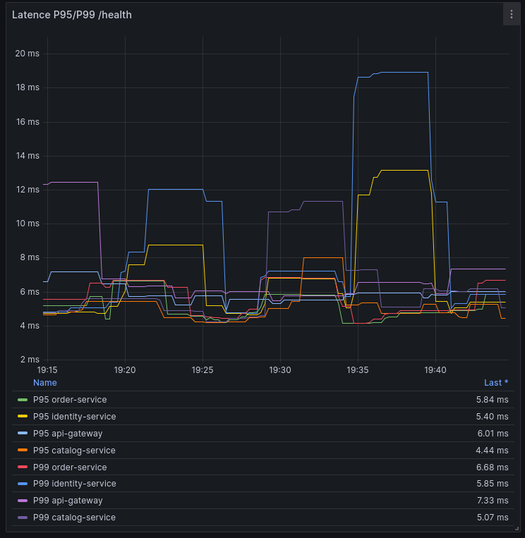

**Figure 10.5-2 — Latence P95/P99 des sondes `/health`.** La latence observée reste très inférieure à la cible de 500 ms : P95 gateway 6,01 ms, P99 gateway 7,33 ms, P95 catalog 4,44 ms, P95 identity 5,40 ms et P95 order 5,84 ms.

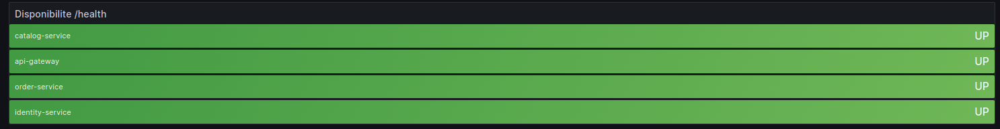

**Figure 10.5-3 — Disponibilité `/health`.** Les services `catalog-service`, `api-gateway`, `order-service` et `identity-service` sont affichés `UP` sur la fenêtre de capture, ce qui valide la connectivité de base entre l'environnement d'observabilité et les services supervisés.

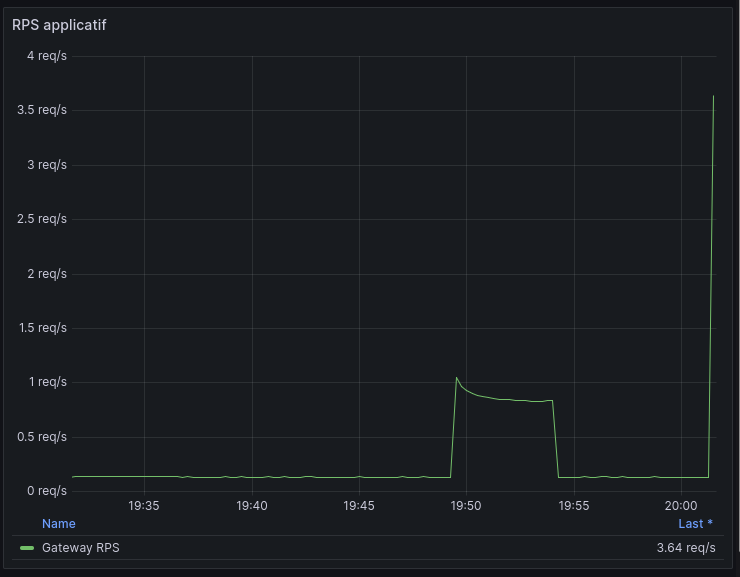

**Figure 10.5-4 — Trafic applicatif gateway.** Le panneau RPS est alimenté par `sum(rate(api_gateway_http_requests_total[5m]))`. La dernière valeur visible est 3,64 req/s après génération de trafic; cette mesure prouve le raccordement applicatif mais ne démontre pas encore la cible de 600 ops/s.

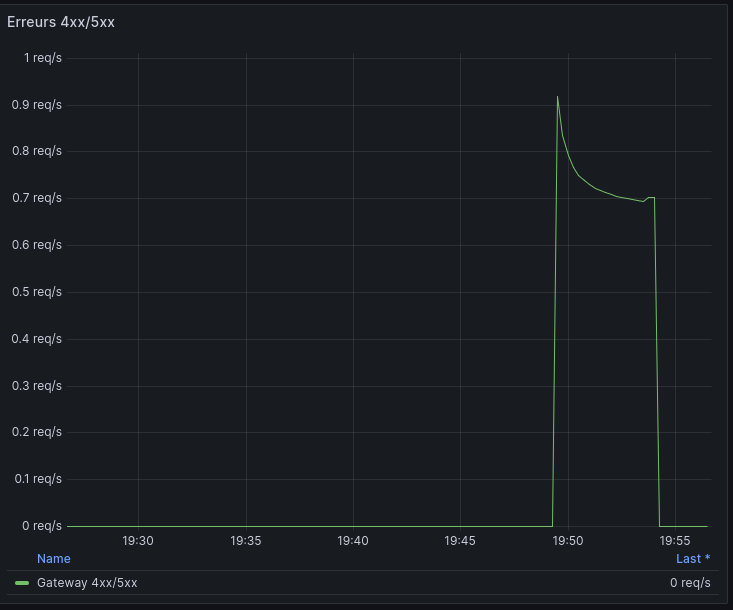

**Figure 10.5-5 — Erreurs 4xx/5xx gateway.** Un scénario négatif sur une route inconnue `/v1/inconnu/test` génère un pic d'environ 0,9 req/s d'erreurs, puis un retour à 0 req/s. Le panneau utilise `api_gateway_http_requests_total{status=~"4..|5.."}` et confirme la visibilité des erreurs applicatives.

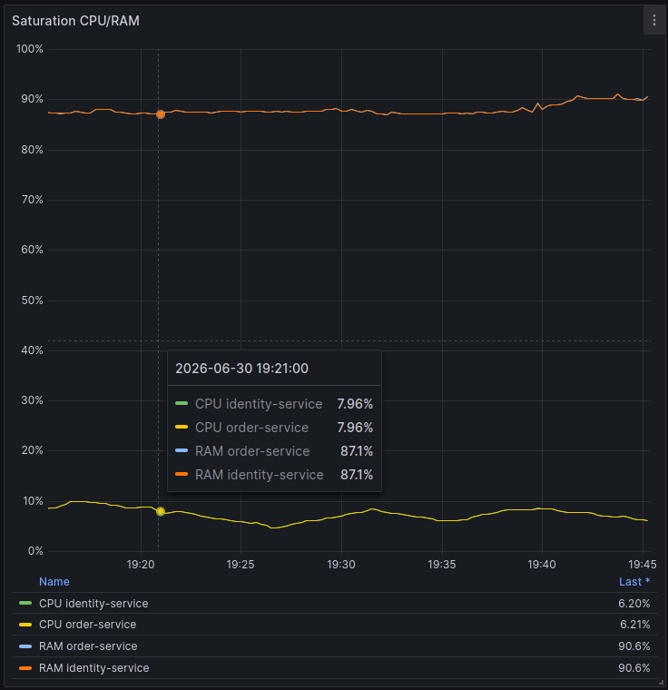

**Figure 10.5-6 — Saturation CPU/RAM.** La CPU reste basse sur la fenêtre observée (`identity-service` 6,20 %, `order-service` 6,21 %). La RAM est en revanche élevée, à 90,6 % pour `identity-service` et `order-service`, au-dessus du seuil recommandé de 80 %. Ce point est traité comme un écart à surveiller plutôt qu'une cible atteinte.

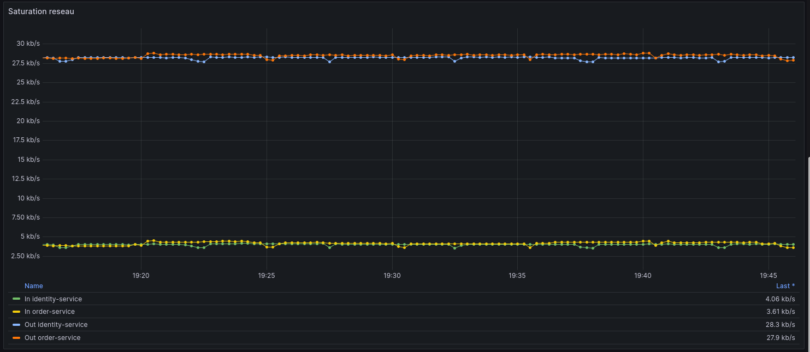

**Figure 10.5-7 — Saturation réseau.** Les dernières valeurs visibles sont stables : entrée `identity-service` 4,06 kb/s, entrée `order-service` 3,61 kb/s, sortie `identity-service` 28,3 kb/s et sortie `order-service` 27,9 kb/s. Aucun pic réseau significatif n'est observé sur cette fenêtre.

### 10.5.3 Analyse des résultats observés

| **Signal** | **Mesure observée** | **Interprétation** |
|------------|---------------------|--------------------|
| Latence | P95 gateway `/health` 6,01 ms; P99 gateway 7,33 ms | Conforme à la cible P95 ≤ 500 ms pour les sondes de santé |
| Trafic | Gateway à 3,64 req/s en dernière valeur visible | Raccordement validé; capacité cible ≥ 600 ops/s non démontrée |
| Erreurs | Pic 4xx/5xx autour de 0,9 req/s lors du test négatif | Les erreurs sont visibles et exploitables dans Grafana |
| Saturation CPU | Environ 6,2 % sur `identity-service` et `order-service` | Conforme sur la fenêtre observée |
| Saturation RAM | 90,6 % sur `identity-service` et `order-service` | Écart par rapport au seuil recommandé < 80 %; à investiguer |
| Saturation réseau | Sortie autour de 28 kb/s; entrée autour de 4 kb/s | Stable et faible sur la fenêtre observée |

Ces captures valident le raccordement d'observabilité applicative et infrastructurelle. Elles ne remplacent pas les campagnes de charge complètes : les mesures UC-03/04/05/08 à haut débit, N = 2..4, kill d'instance, cache on/off et direct vs gateway restent documentées comme travaux de mesure à compléter aux §10.6 à §10.8.

## 10.6 Load balancing (N = 1..4) & tolérance aux pannes

Portée de démonstration : `catalog-service` comme service pilote. Ce choix couvre l'exigence mesurable N = 1..4 et évite de répliquer prématurément le même mécanisme sur tous les services tant que les endpoints métier ne sont pas stabilisés. Le patron reste réplicable service par service via HAProxy.

| **N instances** | **RPS** | **P95 (ms)** | **Erreurs** | **Saturation** |
|-----------------|---------|--------------|-------------|----------------|
| 1               | 19,39 req/s | 55,9 | 0,00 % | Non mesurée |
| 2               | 19,51 req/s | 38,8 | 0,00 % | Non mesurée |
| 3               | 19,42 req/s | 74,84 | 0,00 % | Non mesurée |
| 4               | 19,53 req/s | 41,72 | 0,00 % | Non mesurée |

Mesures réalisées via `k6 run tests/load/catalog-through-gateway.js` sur le trajet `client -> gateway -> HAProxy -> catalog-service`, avec 20 VUs pendant 1 minute. Les instances catalogue additionnelles ont été démarrées sur `100.95.65.46:8140`, `100.95.65.46:8240` et `100.95.65.46:8340`, puis activées progressivement dans `infra/load-balancer/haproxy/catalog.cfg`.

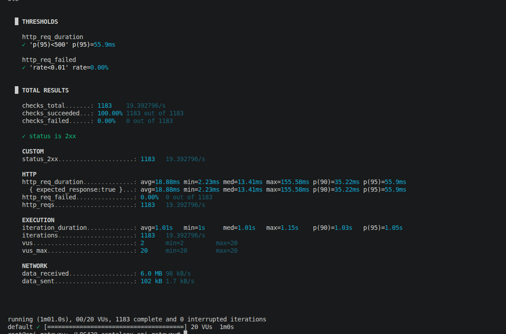

**Figure 10.6-1 — Load balancing catalogue N=1.** 1183 requêtes, 19,39 req/s, 100 % de checks réussis, 0,00 % d'erreurs HTTP, P90 35,22 ms, P95 55,9 ms et maximum 155,58 ms.

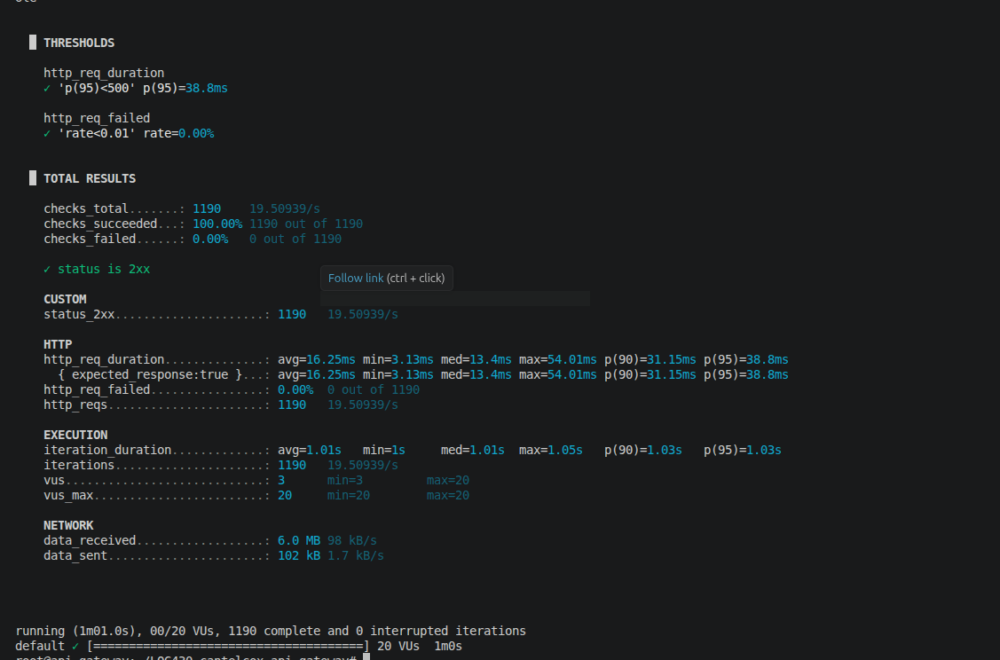

**Figure 10.6-2 — Load balancing catalogue N=2.** 1190 requêtes, 19,51 req/s, 100 % de checks réussis, 0,00 % d'erreurs HTTP, P90 31,15 ms, P95 38,8 ms et maximum 54,01 ms.


**Figure 10.6-3 — Load balancing catalogue N=3.** 1184 requêtes, 19,42 req/s, 100 % de checks réussis, 0,00 % d'erreurs HTTP, P90 43,38 ms, P95 74,84 ms et maximum 124,89 ms.

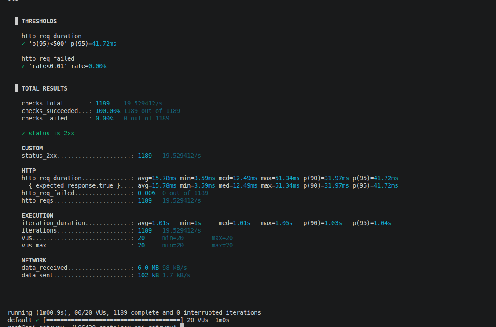

**Figure 10.6-4 — Load balancing catalogue N=4.** 1189 requêtes, 19,53 req/s, 100 % de checks réussis, 0,00 % d'erreurs HTTP, P90 31,97 ms, P95 41,72 ms et maximum 51,34 ms.

La comparaison N = 1..4 valide le patron HAProxy et l'absence d'erreurs lors de l'ajout progressif d'instances. Comme la campagne garde la même charge fixe de 20 VUs avec une pause d'une seconde dans le script k6, le RPS reste mécaniquement autour de 19,4 à 19,5 req/s; ces mesures démontrent surtout la stabilité et la latence sous charge nominale, pas le seuil de saturation maximal. Pour mesurer un gain de capacité, il faudra une campagne avec montée progressive de VUs ou taux d'arrivée constant plus élevé.

### 10.6.1 Tolérance aux pannes - kill d'instance

Une campagne complémentaire a été exécutée pendant 3 minutes avec 20 VUs, en arrêtant une instance `catalog-service` pendant le test. HAProxy devait retirer l'instance défaillante et continuer à router vers les instances restantes.

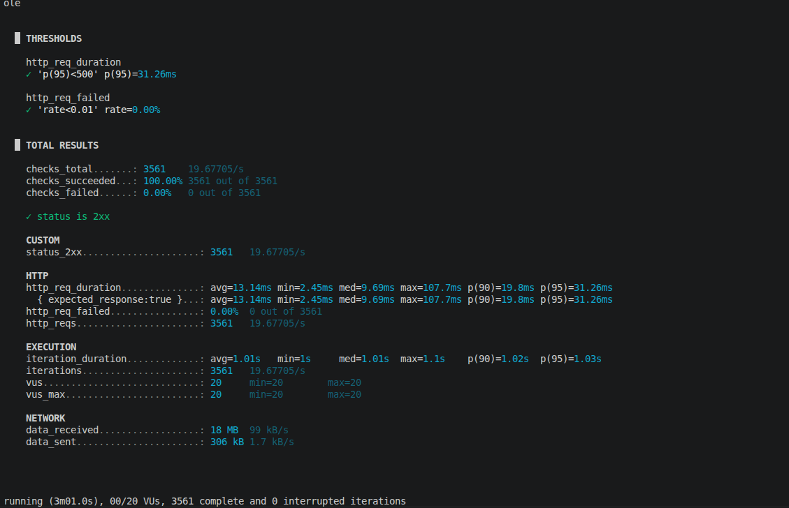

**Figure 10.6-5 — Kill d'instance catalogue pendant charge.** Le test termine avec 3561 requêtes, 19,68 req/s, 100 % de checks réussis, 0,00 % d'erreurs HTTP, P90 19,8 ms, P95 31,26 ms et maximum 107,7 ms. Cette mesure indique que l'arrêt d'une instance n'a pas provoqué d'erreurs visibles côté client pendant la fenêtre testée.

## 10.7 Caching (on / off)

| **Endpoint**                  | **P95 sans cache**    | **P95 avec cache**    | **Charge DB**         | **Gain**              |
|-------------------------------|-----------------------|-----------------------|-----------------------|-----------------------|
| `/v1/catalog/plans` | 72,82 ms | 26,69 ms | Non mesurée | -63,3 % sur P95 |
| `/v1/billing/*` ou usage | Non mesuré | Non mesuré | Non mesurée | À mesurer |

Le cache gateway a été mesuré sur l'endpoint catalogue, avec Redis local et `CACHE_SERVICES=catalog`. Les deux campagnes utilisent le même script k6, 20 VUs pendant 1 minute.


**Figure 10.7-1 — Cache OFF sur `/v1/catalog/plans`.** Avec `CACHE_ENABLED=false`, la campagne produit 1186 requêtes, 19,46 req/s, 0,00 % d'erreurs HTTP, P90 44,42 ms, P95 72,82 ms et maximum 87,01 ms.

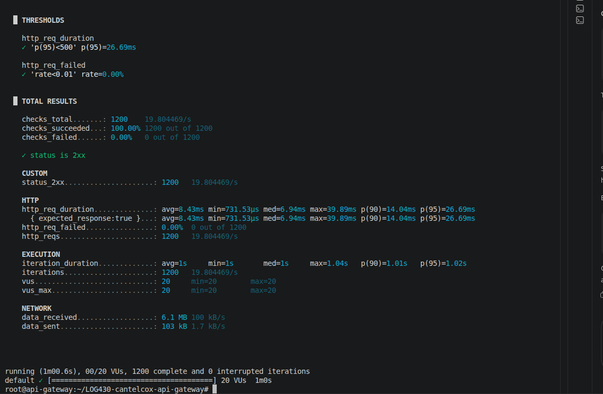

**Figure 10.7-2 — Cache ON sur `/v1/catalog/plans`.** Avec `CACHE_ENABLED=true`, la campagne produit 1200 requêtes, 19,80 req/s, 0,00 % d'erreurs HTTP, P90 14,04 ms, P95 26,69 ms et maximum 39,89 ms.

Le cache réduit le P95 d'environ 63,3 % sur cette campagne (`72,82 ms` à `26,69 ms`) et réduit aussi la latence moyenne de 17,67 ms à 8,43 ms. La charge DB/service amont n'a pas été mesurée directement; le gain est donc exprimé sur la latence observée côté client.

## 10.8 Appels directs vs via Gateway

| **Trajet**  | **P95 (ms)**          | **Erreurs**           | **Traçabilité**       |
|-------------|-----------------------|-----------------------|-----------------------|
| Direct      | 27,08 ms | 0,00 % | Logs service amont |
| Via Gateway | 47,32 ms | 0,00 % | `/routes`, logs JSON gateway, `X-Trace-Id`, métriques Prometheus |

La comparaison est réalisée sur le même endpoint catalogue, avec 20 VUs pendant 1 minute et cache désactivé afin de mesurer le coût du trajet réseau/applicatif plutôt que l'effet Redis.

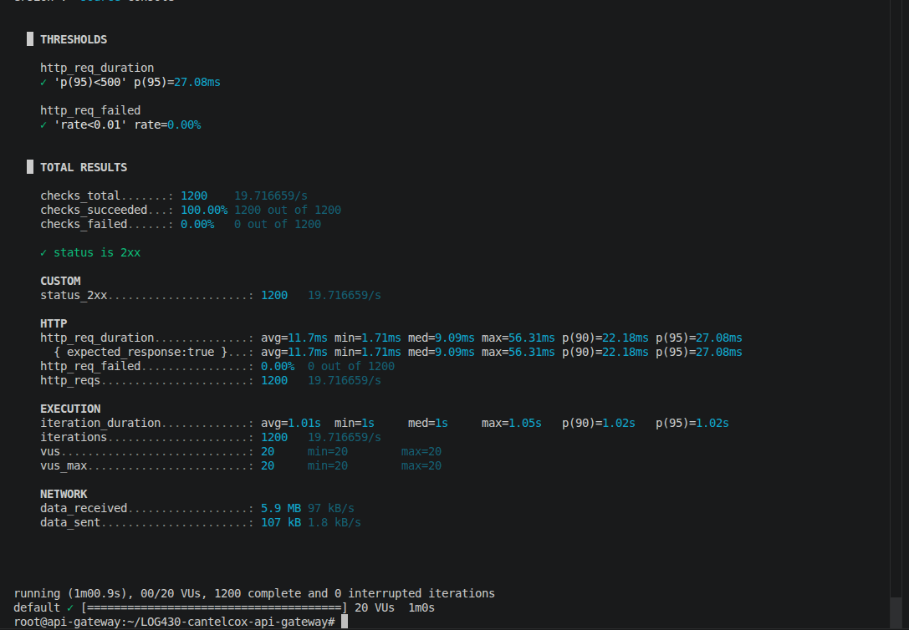

**Figure 10.8-1 — Appel direct `catalog-service`.** Le test direct produit 1200 requêtes, 19,72 req/s, 100 % de checks réussis, 0,00 % d'erreurs HTTP, P90 22,18 ms, P95 27,08 ms et maximum 56,31 ms.

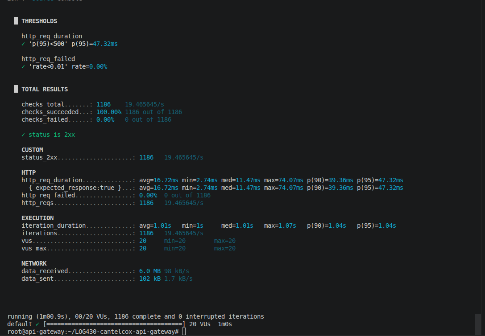

**Figure 10.8-2 — Appel catalogue via API Gateway.** Le test via gateway produit 1186 requêtes, 19,47 req/s, 100 % de checks réussis, 0,00 % d'erreurs HTTP, P90 39,36 ms, P95 47,32 ms et maximum 74,07 ms.

Le surcoût observé du gateway au P95 est de 20,24 ms (`47,32 - 27,08`). Ce coût reste compatible avec la cible P95 ≤ 500 ms et apporte en échange un point d'entrée unique, les logs structurés, `X-Trace-Id`, les métriques Prometheus, la gestion centralisée des erreurs `404/502/503` et le cache optionnel.

# 11. Risques et dette technique

| **Risque / dette**                                          | **Impact**            | **Probabilité**       | **Atténuation**                   |
|-------------------------------------------------------------|-----------------------|-----------------------|-----------------------------------|
| Gateway comme point unique d’entrée | Indisponibilité des appels clients | Moyenne | Ajouter réplication/LB et healthchecks |
| URLs amont incorrectes ou services absents | Routes en `502/503` | Élevée tant que les services sont incomplets | `/routes`, tests de connectivité automatisés, documentation `.env` |
| Métriques applicatives incomplètes dans Grafana | Diagnostic limité | Moyenne | Raccorder `/metrics` dans Prometheus et compléter dashboards Grafana 4 Golden Signals |
| Sécurité gateway incomplète | Accès API trop ouvert | Moyenne | Auth/JWT, rate limiting, validation des tokens, politiques CORS par environnement |
| Données périmées en cache futur | Consultation incohérente | Moyenne | TTL courts, invalidation sur écriture, mesure cache on/off |

# 12. Glossaire

> **Repères de l’énoncé**
>
> **Tâches de l’énoncé :** 1.2 ubiquitous language.
>
> **Livrables attendus :**
>
> - Glossaire métier (langage ubiquitaire) + acronymes.

**Critères d’acceptation (à cocher)**

> ☐ Glossaire validé.

## 12.1 Langage métier

| **Terme**                       | **Définition**                                  | **Bounded context**   |
|---------------------------------|-------------------------------------------------|-----------------------|
| MSISDN                         | Identifiant international d’une ligne mobile | Lignes & Services |
| Forfait                        | Offre mobile souscrite par un client, avec prix et règles d’usage | Catalogue & Offres |
| Commande                       | Demande d’achat, d’activation ou de modification de service | Commandes & Activations |
| Facture                        | Document de facturation pour une période donnée | Usage / Facturation |
| Journal d’audit                | Registre append-only des opérations sensibles | Conformité & Audit |
| Idempotency-Key                | Clé permettant de rejouer une commande sans produire de doublon | Commandes & Activations |

## 12.2 Acronymes

| **Acronyme**          | **Signification**                                                  |
|-----------------------|--------------------------------------------------------------------|
| BSS                   | Business Support System                                            |
| CRTC                  | Conseil de la radiodiffusion et des télécommunications canadiennes |
| free5GC               | Coeur réseau 5G open source utilisé pour le laboratoire            |
| MSISDN                | Mobile Station International Subscriber Directory Number           |
| MFA / OTP             | Authentification multifacteur / mot de passe à usage unique        |
| NFR                   | Exigence non fonctionnelle                                         |
| SUPI                  | Subscription Permanent Identifier                                  |
| **ADR**               | Architecture Decision Record                                       |
| TMF                   | TM Forum (Open APIs)                                               |
| UERANSIM              | Simulateur gNB/UE pour scénarios d’accès 5G                        |
| API Gateway           | Point d’entrée HTTP unique qui route vers les microservices internes |
| LXC                   | Conteneur système pouvant héberger des services laboratoire |
| Tailnet               | Réseau privé Tailscale reliant les VM/LXC |

# Annexe A — Contrats d’API & catalogue d’endpoints

Référez le fichier OpenAPI/Swagger publié et la collection Postman (chemins dans le dépôt).

| **Méthode + Route (/v1)**                        | **UC**                | **Service**           | **Auth / MFA**        |
|--------------------------------------------------|-----------------------|-----------------------|-----------------------|
| `POST /v1/users/*` ou endpoint précis du service identité | UC-01 | `identity-service` | À préciser côté service |
| `POST /v1/auth/*` | UC-02 | `identity-service` | MFA côté service identité |
| `POST /v1/orders/*` | UC-03 / UC-05 | `order-service` | MFA/idempotence à préciser |
| `POST /v1/lines/activations` | UC-03 | `line-service` | MFA/idempotence/free5GC à préciser |
| `GET /v1/lines/*` | UC-03 / UC-04 | `line-service` | Selon politique d’accès |
| `GET /v1/catalog/*` | UC-05 | `catalog-service` | Selon politique d’accès |
| `GET /v1/billing/*` | UC-04 / UC-06 / UC-08 | `billing-service` | Auth requise; service à configurer |
| `POST /v1/audit/*` | UC-07 / conformité | `audit-service` | Service interne; à configurer |

*Liens : Swagger gateway = `http://127.0.0.1:8000/docs` · Postman = à produire.*

# Annexe B — Schéma de persistance

Modèle logique (ER/UML) par service, choix ORM/DAO, contraintes, migrations et données seed.

Le gateway ne possède pas de schéma de persistance. Les schémas ER/UML doivent être produits par service métier.

| **Élément**             | **Détail**                                                           |
|-------------------------|----------------------------------------------------------------------|
| Contraintes d’intégrité | À documenter côté services : unicité MSISDN, clés de déduplication, FK internes, index |
| Migrations              | À préciser par service métier |
| Données seed            | À produire : catalogue de forfaits, abonnés, lignes et factures de test |
| Tests d’intégration     | À ajouter : DB conteneurisée ou services simulés |

# Annexe C — CI/CD, conteneurisation & exploitation

| **Élément**             | **Détail**                                                                                     |
|-------------------------|------------------------------------------------------------------------------------------------|
| Dockerfiles             | `Dockerfile` gateway présent; Dockerfiles des services métier à compléter dans leurs dépôts |
| docker-compose.yml      | Lance `api-gateway` avec `network_mode: host` et `.env`; compose complet services + DB + observabilité + cache à compléter |
| Healthchecks            | /health par service                                                                            |
| Pipeline CI             | À ajouter : lint → build → tests unitaires/intégration/E2E → artefacts; cible < 10 min |
| Job CD (VM)             | À ajouter : script de déploiement et rollback simple |
| Runbook & guide de démo | `docs/runbook.md` existe; à compléter avec scénario E2E, observabilité et panne |

# Annexe D — Traçabilité, Définition de Fini & auto-évaluation

## D.1 Matrice de traçabilité (livrables & critères d’acceptation)

Cochez chaque case (☐) lorsque le livrable est produit et le critère d’acceptation satisfait ; indiquez la preuve (figure, section ou chemin dans le dépôt). « Empl. » renvoie à la section du présent document.

<table>
<colgroup>
<col style="width: 14%" />
<col style="width: 27%" />
<col style="width: 27%" />
<col style="width: 17%" />
<col style="width: 12%" />
</colgroup>
<thead>
<tr class="header">
<th><strong>Tâche</strong></th>
<th><strong>Livrables → empl.</strong></th>
<th><strong>Critères d’acceptation → empl.</strong></th>
<th><strong>Preuve</strong></th>
<th><strong>Fait</strong></th>
</tr>
</thead>
<tbody>
<tr class="odd">
<td colspan="5"><strong>1) Analyse métier &amp; DDD</strong></td>
</tr>
<tr class="even">
<td><strong>1.1 UC Must</strong></td>
<td>§1.1, §1.2</td>
<td>§1.2 — ≥ 5 UC validés</td>
<td><em>[…]</em></td>
<td><p>☐ Livrable</p>
<p>☐ CA</p></td>
</tr>
<tr class="odd">
<td><strong>1.2 DDD</strong></td>
<td>§3.1, §3.3, §5.3, §12.1</td>
<td>§12.1 ; §5.3 ; §3.3+§4.1</td>
<td><em>[…]</em></td>
<td><p>☐ Livrable</p>
<p>☐ CA</p></td>
</tr>
<tr class="even">
<td colspan="5"><strong>2) Architecture &amp; décisions</strong></td>
</tr>
<tr class="odd">
<td><strong>2.1 Services</strong></td>
<td>§4.1, §4.2, §5.2</td>
<td>§4.2, §5.1 ; §4.1</td>
<td><em>[…]</em></td>
<td><p>☐ Livrable</p>
<p>☐ CA</p></td>
</tr>
<tr class="even">
<td><strong>2.2 API REST</strong></td>
<td>§4.3, §4.4, Annexe A</td>
<td>Annexe A ; §5.2/§5.4</td>
<td><em>[…]</em></td>
<td><p>☐ Livrable</p>
<p>☐ CA</p></td>
</tr>
<tr class="odd">
<td><strong>2.3 4+1 / Arc42</strong></td>
<td>§5, §6, §7, §1.2/§10 ; §1→§12</td>
<td>figures : §3.1, §5.1, §5.2, §6, §7.1</td>
<td><em>[…]</em></td>
<td><p>☐ Livrable</p>
<p>☐ CA</p></td>
</tr>
<tr class="even">
<td><strong>2.4 ADR (≥ 3)</strong></td>
<td>§9 (ADR-001/002/003)</td>
<td>§9 — tracé au cahier</td>
<td><em>[…]</em></td>
<td><p>☐ Livrable</p>
<p>☐ CA</p></td>
</tr>
<tr class="odd">
<td colspan="5"><strong>3) Persistance &amp; intégrité</strong></td>
</tr>
<tr class="even">
<td><strong>3.1 Schéma</strong></td>
<td>§8.1, Annexe B</td>
<td>Annexe B — migrations, seeds</td>
<td><em>[…]</em></td>
<td><p>☐ Livrable</p>
<p>☐ CA</p></td>
</tr>
<tr class="odd">
<td><strong>3.2 Intégrité</strong></td>
<td>§8.2, §8.3, §8.4, Annexe B</td>
<td>§8.1–8.2 ; §6.3</td>
<td><em>[…]</em></td>
<td><p>☐ Livrable</p>
<p>☐ CA</p></td>
</tr>
<tr class="even">
<td colspan="5"><strong>4) Implémentation &amp; API REST sécurisée</strong></td>
</tr>
<tr class="odd">
<td><strong>4.1 Domaine</strong></td>
<td>§5.3, §8.5, §8.6</td>
<td>§5.3 ; §10.4</td>
<td><em>[…]</em></td>
<td><p>☐ Livrable</p>
<p>☐ CA</p></td>
</tr>
<tr class="even">
<td><strong>4.2 Ports/adapt.</strong></td>
<td>§3.2, §5.2</td>
<td>§5.2/§5.4</td>
<td><em>[…]</em></td>
<td><p>☐ Livrable</p>
<p>☐ CA</p></td>
</tr>
<tr class="odd">
<td><strong>4.3 API E2E</strong></td>
<td>§6.1, Annexe A</td>
<td>§6.1 ; §8.7</td>
<td><em>[…]</em></td>
<td><p>☐ Livrable</p>
<p>☐ CA</p></td>
</tr>
<tr class="even">
<td><strong>4.4 Sécurité</strong></td>
<td>§8.5</td>
<td>§8.5 — MFA UC-02/03</td>
<td><em>[…]</em></td>
<td><p>☐ Livrable</p>
<p>☐ CA</p></td>
</tr>
<tr class="odd">
<td colspan="5"><strong>5) Observabilité, charge &amp; optimisation</strong></td>
</tr>
<tr class="even">
<td><strong>5.1 Observ.</strong></td>
<td>§8.8, §10.5</td>
<td>§10.5 ; §10.3</td>
<td><em>[…]</em></td>
<td><p>☐ Livrable</p>
<p>☐ CA</p></td>
</tr>
<tr class="odd">
<td><strong>5.2 Charge</strong></td>
<td>§10.5</td>
<td>§10.5 ; §10.3</td>
<td><em>[…]</em></td>
<td><p>☐ Livrable</p>
<p>☐ CA</p></td>
</tr>
<tr class="even">
<td><strong>5.3 Load balancing</strong></td>
<td>§7.3, §10.6</td>
<td>§10.6</td>
<td><em>[…]</em></td>
<td><p>☐ Livrable</p>
<p>☐ CA</p></td>
</tr>
<tr class="odd">
<td><strong>5.4 Caching</strong></td>
<td>§8.9, §10.7</td>
<td>§8.9 ; §10.7</td>
<td><em>[…]</em></td>
<td><p>☐ Livrable</p>
<p>☐ CA</p></td>
</tr>
<tr class="even">
<td colspan="5"><strong>6) API Gateway</strong></td>
</tr>
<tr class="odd">
<td><strong>6.1 Gateway</strong></td>
<td>§7.2</td>
<td>§7.2</td>
<td><em>[…]</em></td>
<td><p>☐ Livrable</p>
<p>☐ CA</p></td>
</tr>
<tr class="even">
<td><strong>6.2 Direct vs GW</strong></td>
<td>§10.8</td>
<td>§10.8 ; §10.5</td>
<td><em>[…]</em></td>
<td><p>☐ Livrable</p>
<p>☐ CA</p></td>
</tr>
<tr class="odd">
<td colspan="5"><strong>7) Qualité, tests &amp; sécurité</strong></td>
</tr>
<tr class="even">
<td><strong>7.1 Tests</strong></td>
<td>§10.4</td>
<td>§10.4 ; §6.1</td>
<td><em>[…]</em></td>
<td><p>☐ Livrable</p>
<p>☐ CA</p></td>
</tr>
<tr class="odd">
<td><strong>7.2 Séc./erreurs</strong></td>
<td>§8.5, §8.6, §8.7</td>
<td>§8.5/§8.6/§8.7</td>
<td><em>[…]</em></td>
<td><p>☐ Livrable</p>
<p>☐ CA</p></td>
</tr>
<tr class="even">
<td colspan="5"><strong>8) CI/CD &amp; conteneurisation</strong></td>
</tr>
<tr class="odd">
<td><strong>8.1 Conteneurs</strong></td>
<td>§7.1, Annexe C</td>
<td>Annexe C — compose up, /health</td>
<td><em>[…]</em></td>
<td><p>☐ Livrable</p>
<p>☐ CA</p></td>
</tr>
<tr class="even">
<td><strong>8.2 CI</strong></td>
<td>Annexe C</td>
<td>Annexe C — CI &lt; 10 min</td>
<td><em>[…]</em></td>
<td><p>☐ Livrable</p>
<p>☐ CA</p></td>
</tr>
<tr class="odd">
<td><strong>8.3 CD</strong></td>
<td>Annexe C</td>
<td>Annexe C — déploiement 1 commande</td>
<td><em>[…]</em></td>
<td><p>☐ Livrable</p>
<p>☐ CA</p></td>
</tr>
<tr class="even">
<td colspan="5"><strong>9) Documentation finale &amp; démo</strong></td>
</tr>
<tr class="odd">
<td><strong>9.1 Doc finale</strong></td>
<td>Document entier, Annexe C</td>
<td>Annexe C ; Annexe D.2 (DoD)</td>
<td><em>[…]</em></td>
<td><p>☐ Livrable</p>
<p>☐ CA</p></td>
</tr>
<tr class="even">
<td><strong>9.2 Comparatif</strong></td>
<td>§10.3, §10.6–10.8</td>
<td>§10.3 ; §10.5–10.8</td>
<td><em>[…]</em></td>
<td><p>☐ Livrable</p>
<p>☐ CA</p></td>
</tr>
</tbody>
</table>

## D.2 Définition de Fini (DoD)

> ☐ ≥ 5 UC Must implémentés bout-en-bout via l’API REST, erreurs normalisées.
>
> ☐ ≥ 2 microservices conteneurisés + DB + Prometheus + Grafana + API Gateway, déployables via docker-compose.
>
> ☐ Idempotence (commandes/activations), exactly-once (facturation), journal append-only opérationnels.
>
> ☐ Tests automatisés en CI (unit, intégration, E2E), couverture ≥ 80 % sur le domaine critique.
>
> ☐ 4 Golden Signals observés ; paliers NFR atteints ou écarts argumentés (P95 ≤ 500 ms, ≥ 600 ops/s, dispo 95 %).
>
> ☐ Campagnes de charge avec comparatifs (avant/après, N = 1..4 sur `catalog-service` pilote), tolérance aux pannes démontrée.
>
> ☐ LB et cache en production (compose) avec impacts chiffrés.
>
> ☐ API Gateway opérationnelle ; direct vs gateway comparés et argumentés.
>
> ☐ 4+1 cohérent, Arc42 (sections cœur), ≥ 3 ADR approuvés ; CI/CD fonctionnels.
>
> ☐ Logs structurés ; runbook & guide de démo à jour.
>
> ☐ Rapport PDF + dépôt projet (zip) remis sur Moodle ; reproductibilité \< 30 min sur VM.

## D.3 Auto-évaluation (grille de l’énoncé)

| **Critère**                            | **Pond.** | **Section(s) de preuve**   | **Auto-éval**                 |
|----------------------------------------|-----------|----------------------------|-------------------------------|
| 1\. Analyse métier & DDD               | 12 %      | **§1, §3.3, §5.3, §12**    | Partiel |
| 2\. Architecture, décisions & API REST | 18 %      | **§4, §5, §9, Annexe A**   | Partiel |
| 3\. Persistance & intégrité            | 12 %      | **§8.1–8.4, Annexe B**     | À faire côté services |
| 4\. Microservices & API Gateway        | 18 %      | **§5.1, §7.2, §10.8**      | Partiel; gateway fait |
| 5\. Observabilité & tests de charge    | 10 %      | **§8.8, §10.5**            | Partiel; charge à faire |
| 6\. Load balancing & caching           | 10 %      | **§7.3, §8.9, §10.6–10.7** | À faire |
| 7\. Qualité, tests & sécurité          | 10 %      | **§8.5–8.7, §10.4**        | Partiel |
| 8\. CI/CD, documentation & démo        | 10 %      | **§7.1, Annexe C**         | Partiel |

# Annexe E — Soutenance et démonstration (20 %)

Durée : 12 à 15 minutes de présentation + questions. Objectif : démontrer que l’architecture décrite fonctionne et que les décisions sont défendables.

## E.1 Déroulé attendu

| **Étape**                           | **Contenu**                                                                       | **Durée** |
|-------------------------------------|-----------------------------------------------------------------------------------|-----------|
| 1\. Contexte & objectifs de qualité | Mission CanTelcoX, cibles NFR (P95 ≤ 500 ms, ≥ 600 ops/s, dispo 95 %)             | 1–2 min   |
| 2\. Tour d’architecture             | Carte de contextes (DDD) et choix structurants                                    | 3–4 min   |
| 3\. Démo en direct                  | Scénario de bout en bout : déclenchement via une API, propagation entre contextes | 4–5 min   |
| 4\. Défense d’un ADR                | Pourquoi cette décision, quelles alternatives écartées                            | 2 min     |
| 5\. Questions                       | Échange avec le jury                                                              | 3–4 min   |

## E.2 Grille de soutenance

| **Critère de soutenance / démo**                             | **Pts** |
|--------------------------------------------------------------|---------|
| Maîtrise de l’architecture présentée (vocabulaire, justesse) | 5       |
| Démonstration fonctionnelle d’un scénario de bout en bout    | 5       |
| Justification des décisions (au moins un ADR défendu)        | 4       |
| Qualité des réponses aux questions                           | 3       |
| Clarté, structure et respect du temps                        | 3       |
| **TOTAL — SOUTENANCE**                                       | **20**  |

## E.3 Plan de soutenance (à préparer)

|                                  |                                                                                            |
|----------------------------------|--------------------------------------------------------------------------------------------|
| **Scénario E2E démontré**        | Minimal actuel : `/health`, `/routes`, proxy `/v1/orders/*`, `/v1/lines/*` ou `/v1/auth/*`; cible : inscription → MFA → commande → activation line-service/free5GC → consultation usage |
| **ADR défendu**                  | ADR-0002 API Gateway ou ADR-0006 Tailscale, selon la démo réseau |
| **Répartition des intervenants** | À compléter par l’équipe |
| **Environnement de démo**        | VM/LXC + Tailnet; `docker compose up --build`; services amont configurés dans `.env` |
| **Plan B (si la démo échoue)**   | Captures de `/health`, `/routes`, Swagger et logs `502/503`; scénario dégradé limité au gateway |

# Annexe F — État d’avancement et reste à faire

## F.1 Fait / documenté dans ce dépôt

| **Élément** | **Preuve** |
|-------------|------------|
| API Gateway FastAPI | `app/main.py` |
| Endpoint santé | `GET /health` |
| Table de routage observable | `GET /routes` |
| Routage `/v1/users/*` et `/v1/auth/*` | `ROUTE_TARGETS`, `IDENTITY_SERVICE_URL` |
| Routage `/v1/orders/*` | `ROUTE_TARGETS`, `ORDER_SERVICE_URL` |
| Routage `/v1/lines/*` | `ROUTE_TARGETS`, `LINE_SERVICE_URL` |
| Routage `/v1/catalog/*` | `ROUTE_TARGETS`, `CATALOG_SERVICE_URL` |
| Routes préparées `/v1/customers/*`, `/v1/billing/*`, `/v1/audit/*` | `ROUTE_TARGETS`, variables d’environnement |
| Erreurs gateway `404/502/503` | `app/main.py` |
| Filtrage des headers hop-by-hop | `HOP_BY_HOP_HEADERS` |
| CORS local | `CORSMiddleware` |
| Configuration par `.env` | `app/core/config.py`, `docker-compose.yml` |
| Conteneurisation gateway | `Dockerfile`, `docker-compose.yml` |
| Documentation Arc42 modulaire | `docs/arc42/*.md` |
| ADR acceptés observabilité et Tailscale | `docs/adr/0005-observability-lxc.md`, `docs/adr/0006-utilisation-tailscale.md` |

## F.1.1 Dépôts GitHub des services métier

Les services métier sont livrés dans des dépôts GitHub séparés. Le présent dépôt
documente le gateway, le routage, les mesures d'intégration et les preuves de
connexion vers ces services.

| **Service** | **Dépôt GitHub** |
|-------------|------------------|
| `identity-service` | <https://github.com/Amjad-Lekhdar/LOG430-cantelcox-identity-service> |
| `order-service` | <https://github.com/Amjad-Lekhdar/LOG430-cantelcox-order-service> |
| `catalog-service` | <https://github.com/Amjad-Lekhdar/LOG430-cantelcox-catalog-service> |
| `line-service` | <https://github.com/Amjad-Lekhdar/LOG430-cantelcox-line-service> |
| `customers-service` | <https://github.com/Amjad-Lekhdar/LOG430-cantelcox-customers-service> |
| `billing-service` | <https://github.com/Amjad-Lekhdar/LOG430-cantelcox-billing-service> |
| `audit-service` | <https://github.com/Amjad-Lekhdar/LOG430-cantelcox-audit-service> |

## F.2 Reste à faire

| **Priorité** | **Travail restant** |
|--------------|---------------------|
| Haute | Compléter les ADR 0001 à 0004 avec statut, contexte, décision, conséquences et conformité |
| Haute | Raccorder et démontrer depuis ce dépôt les services hébergés dans des dépôts GitHub séparés : `line-service`, `customers-service`, `billing-service`, `audit-service` |
| Haute | Décrire et tester au moins 5 UC Must bout-en-bout via le gateway |
| Haute | Normaliser le format d’erreur JSON inter-services avec `traceId` |
| Haute | Ajouter les tests automatisés gateway et E2E; viser ≥ 80 % sur le domaine critique |
| Haute | Produire les schémas de persistance, migrations et seeds des services métier |
| Haute | Implémenter idempotence, exactly-once et journal append-only côté services concernés |
| Moyenne | Raccorder `/metrics` Prometheus aux dashboards Grafana 4 Golden Signals |
| Moyenne | Réaliser les campagnes de charge et remplir §10.3, §10.5 à §10.8 |
| Moyenne | Finaliser load balancing N = 1..4 sur `catalog-service` pilote et test de kill d’instance |
| Moyenne | Implémenter caching sur endpoints candidats et mesurer cache on/off |
| Moyenne | Finaliser sécurité gateway : JWT/API key, rate limiting, CORS par environnement |
| Moyenne | Produire collection Postman/OpenAPI complète des services métier |
| Moyenne | Compléter CI/CD et runbook de démo reproductible en moins de 30 min |
