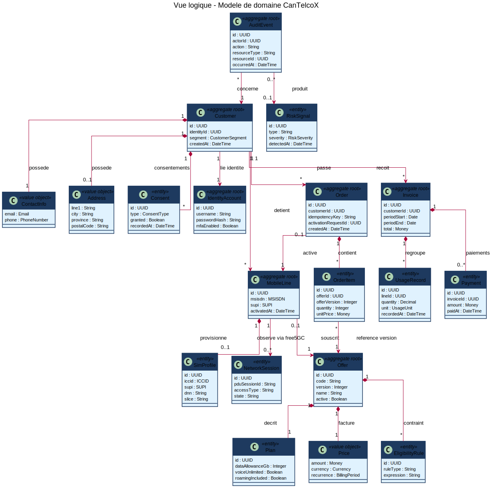
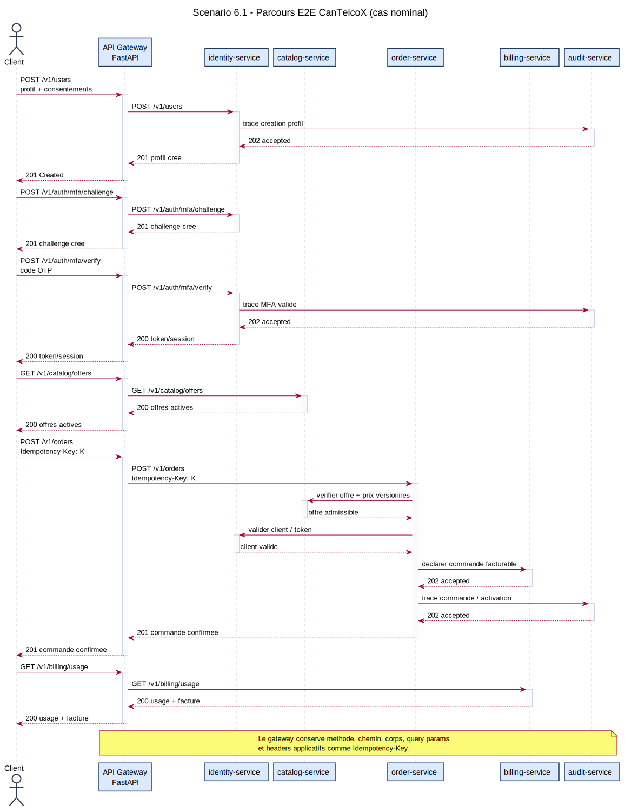

# Documentation d'architecture - CanTelcoX API Gateway

Template arc42 v8 + vues 4+1 de Kruchten + ADR.

## Métadonnées

| Métadonnée | Valeur |
| --- | --- |
| Système | CanTelcoX API Gateway |
| Version du document | 0.1 |
| Date | 2026-06-08 |
| Auteurs | Équipe LOG430 |
| Statut | Draft |
| Audience | Développeurs, exploitation, évaluateurs LOG430 |

## Table des matières

1. [Introduction et objectifs](#1-introduction-et-objectifs)
2. [Contraintes d'architecture](#2-contraintes-darchitecture)
3. [Contexte et portée du système](#3-contexte-et-portée-du-système)
4. [Stratégie de solution](#4-stratégie-de-solution)
5. [Vue de construction](#5-vue-de-construction-building-blocks)
6. [Vue d'exécution](#6-vue-dexécution-runtime)
7. [Vue de déploiement](#7-vue-de-déploiement)
8. [Concepts transversaux](#8-concepts-transversaux)
9. [Décisions d'architecture - index ADR](#9-décisions-darchitecture---index-adr)
10. [Exigences de qualité](#10-exigences-de-qualité)
11. [Risques et dette technique](#11-risques-et-dette-technique)
12. [Glossaire](#12-glossaire)
13. [Sources documentaires](#13-sources-documentaires)

# 1. Introduction et objectifs

## 1.1 Aperçu des exigences

CanTelcoX API Gateway est la facade REST exposée au frontend Expo et aux clients externes.
Son rôle est de fournir une URL d'entrée unique et de router les appels vers les services internes de la plateforme CanTelcoX.

Le gateway ne porte pas la logique métier principale. Il agit comme point d'accès, applique les règles communes de proxy HTTP et masque la localisation réelle des microservices.
Le dossier de domaine positionne CanTelcoX comme une plateforme BSS couvrant le cycle de vie client d'une ligne mobile, depuis l'inscription et l'activation jusqu'à la consultation d'usage, la facturation, le paiement et la détection de fraude (CanTelcoX_Dossier_Domaine.pdf, p. 4).

Fonctionnalités principales:

- Exposer un endpoint de santé `GET /health`.
- Exposer la table de routage effective avec `GET /routes`.
- Router les appels `/v1/users/*` et `/v1/auth/*` vers `identity-service`.
- Router les appels `/v1/orders/*` vers `order-service`.
- Router les appels `/v1/catalog/*` vers `catalog-service`.
- Préparer les routes `/v1/customers/*`, `/v1/billing/*` et `/v1/audit/*` vers des services dédiés configurables.
- Retourner une erreur explicite lorsqu'un service amont n'est pas configuré ou indisponible.

## 1.2 Objectifs de qualité

Les objectifs suivants sont dérivés de la section 3 du cahier de charge, qui fixe les exigences non fonctionnelles de CanTelcoX.

| # | Objectif de qualité | Cible attendue | Impact sur le gateway |
| --- | --- | --- | --- |
| 1 | Performance | Latence P95 opération -> ACK <= 500 ms en phase microservices; cible <= 250 ms en architecture event-driven | Le gateway doit rester un proxy léger, éviter les traitements métier et limiter la surcharge ajoutée aux appels HTTP. |
| 2 | Débit | >= 600 opérations/s en phase microservices; cible >= 1000 opérations/s en architecture event-driven | Le routage doit rester simple et les services doivent pouvoir évoluer indépendamment derrière le gateway. |
| 3 | Disponibilité | 95 % en phase microservices; cible 99 % en architecture event-driven | Le gateway doit retourner des erreurs explicites (`502`, `503`) et permettre de détecter rapidement les services indisponibles. |
| 4 | Observabilité | Logs structurés et métriques dès la phase 1; traces distribuées à partir de la phase 2 | Le gateway expose `/health`, `/routes` et `/metrics`; les logs JSON incluent un `trace_id` propagé vers les services amont. |
| 5 | Conformité et auditabilité | Idempotence des commandes et activations, écritures de facturation fiables, journaux append-only, traçabilité CRTC/Loi 25 | Le gateway doit pouvoir transmettre les informations nécessaires aux services métier et rester compatible avec les futures politiques d'audit, d'authentification et d'autorisation. |
| 6 | Sécurité opérationnelle | Contrôles anti-fraude attendus pour SIM swap, usage anormal et fraude roaming | Le gateway sert de point d'entrée unique et devra supporter les contrôles d'accès communs, même si la logique anti-fraude détaillée appartient aux services métier. |

## 1.3 Parties prenantes

| Rôle | Nom / Groupe | Attentes |
| --- | --- | --- |
| Utilisateur final | Utilisateurs du frontend Expo | Accéder aux fonctionnalités CanTelcoX via une API stable. |
| Équipe backend | Développeurs CanTelcoX | Déployer et faire évoluer les services indépendamment. |
| Équipe exploitation | Ops / laboratoire | Observer l'état des services et diagnostiquer les erreurs de routage. |
| Évaluateurs | Enseignants LOG430 | Vérifier les choix d'architecture et leur justification documentaire. |

# 2. Contraintes d'architecture

## 2.1 Contraintes techniques

- Le gateway est implémenté en Python avec FastAPI.
- Le conteneur Docker du gateway est construit depuis le `Dockerfile` à la racine du dépôt.
- Les services amont peuvent tourner sur des VM/LXC distinctes et ne sont pas nécessairement présents dans ce dépôt.
- Les URLs des services amont sont injectées par variables d'environnement.
- Le déploiement Docker Compose actuel lance uniquement le gateway localement et s'appuie sur `network_mode: host`.
- Les services observés doivent exposer un endpoint `/health`.
- Les services métier exposent des APIs HTTP REST/JSON consommées par le gateway.
- Chaque service métier doit pouvoir être configuré par une URL amont dédiée et déployé indépendamment.
- Les services qui possèdent de la persistance utilisent PostgreSQL comme base de données relationnelle.
- Le frontend est une application Expo développée en TypeScript.
- Le frontend doit consommer l'API via le gateway comme point d'entrée unique, sans appeler directement les services internes.
- Le gateway doit autoriser les origines de développement nécessaires au frontend local grâce à sa configuration CORS.

## 2.2 Contraintes organisationnelles

- Le projet documente les décisions structurantes avec des ADR.
- L'architecture cible suit une approche microservices.
- Les services métier doivent être déployables indépendamment lorsque leur maturité le permet.

## 2.3 Contraintes réglementaires et juridiques

Le cahier des charges définit CanTelcoX comme la plateforme commerciale d'un opérateur mobile canadien.
Le système cible est un BSS moderne destiné aux abonnés particuliers et PME, couvrant le cycle de vie des lignes mobiles: souscription, activation, consultation d'usage, prise de commande de forfaits et d'options, paiement de facture et conformité réglementaire.

Le secteur canadien des télécommunications impose un cadre réglementaire strict:

- CRTC et Loi sur les télécommunications pour les obligations propres aux opérateurs télécoms.
- Loi 25 et LPRPDE pour la protection des renseignements personnels.
- Transparence tarifaire, étiquetage clair des offres et portabilité obligatoire des numéros.
- Contrôles de sécurité liés aux activations, notamment contre la fraude SIM swap et l'usurpation d'identité.
- Exigence élevée de disponibilité, car les communications mobiles sont considérées comme critiques.

Le dossier de domaine précise que le CRTC encadre notamment les contrats sans fil, la transparence tarifaire, la portabilité des numéros, l'accès 9-1-1 et certaines communications commerciales. Il rappelle aussi que la LPRPDE et la Loi 25 imposent des exigences de consentement, de sécurité, de traçabilité, d'accès, d'effacement et de notification d'incident (CanTelcoX_Dossier_Domaine.pdf, p. 7).

La plateforme doit concilier innovation produit, sécurité, conformité et résilience opérationnelle.
Elle doit supporter des opérations en temps réel, comme l'activation, la consultation et la modification de services, ainsi que des traitements différés, comme la valorisation des usages et le cycle de facturation mensuel.
Dans le MVP, le gateway ne porte pas directement les règles réglementaires détaillées. Ces règles seront principalement implémentées dans les services métier. Le gateway doit cependant fournir une base fiable pour les supporter: routage vers les bons services, observabilité minimale, et possibilité d'ajouter plus tard l'authentification, l'autorisation et l'audit.

## 2.4 Contraintes de réseau

Les VM/LXC du laboratoire sont reliées avec Tailscale.
Le Tailnet fournit des adresses stables utilisées par le gateway pour joindre les services internes sans les exposer directement sur Internet.
La justification complète de ce choix est documentée dans [ADR 0006](adr/0006-utilisation-tailscale.md).

| Service | Adresse Tailnet connue |
| --- | --- |
| `identity-service` | `100.83.57.43:8020` |
| `order-service` | `100.108.225.1:8030` |
| `catalog-service` | `100.95.65.46:8040` |
| `customers-service` | `100.99.167.126:8050` |
| `billing-service` | `100.114.185.38:8060` |
| `audit-service` | `100.94.161.70:8070` |
| `observability` | `100.87.177.66` |

Le gateway doit pouvoir joindre les machines Tailnet depuis son environnement d'exécution.

# 3. Contexte et portée du système

## 3.1 Contexte métier

CanTelcoX est une plateforme télécom découpée en services spécialisés.
Le gateway sert d'entrée commune pour les clients et délègue les traitements aux services responsables de chaque domaine.
Le découpage tient compte des capacités typiques d'un BSS moderne: gestion client, catalogue produit, gestion des commandes, provisioning, médiation, rating, facturation, paiement, self-care, fraude et revenue assurance (CanTelcoX_Dossier_Domaine.pdf, p. 12).

| Partenaire | Direction | Protocole / Format | Description |
| --- | --- | --- | --- |
| Frontend Expo | in | HTTP / JSON | Client utilisateur principal. |
| Clients externes | in | HTTP / JSON | Consommateurs API potentiels. |
| `identity-service` | out | HTTP / JSON | Gestion des utilisateurs et de l'authentification. |
| `order-service` | out | HTTP / JSON | Gestion des commandes. |
| `catalog-service` | out | HTTP / JSON | Gestion du catalogue. |
| `customers-service` | out | HTTP / JSON | Domaine clients prévu, URL à configurer. |
| `billing-service` | out | HTTP / JSON | Domaine facturation prévu, URL à configurer. |
| `audit-service` | out | HTTP / JSON | Domaine audit prévu, URL à configurer. |
| Observability | in | Prometheus / Grafana / Blackbox Exporter | Supervision des endpoints de santé. |

## 3.2 Contexte technique

Le gateway expose les routes publiques sous `/v1`.
Il construit une URL amont à partir du service demandé, du chemin restant et des paramètres de requête.
Les headers HTTP hop-by-hop sont filtrés pour éviter de transmettre des informations propres à une connexion intermédiaire.
Les contrats REST internes peuvent s'inspirer des TM Forum Open APIs, notamment TMF620 pour le catalogue, TMF622 pour les commandes, TMF629 pour la gestion client, TMF635 pour l'usage, TMF678 pour les factures, TMF676 pour les paiements et TMF688 pour les événements inter-domaines (CanTelcoX_Dossier_Domaine.pdf, p. 19).

| Variable | Usage |
| --- | --- |
| `IDENTITY_SERVICE_URL` | Cible des routes `/v1/users/*` et `/v1/auth/*` |
| `ORDER_SERVICE_URL` | Cible des routes `/v1/orders/*` |
| `CATALOG_SERVICE_URL` | Cible des routes `/v1/catalog/*` |
| `CUSTOMERS_SERVICE_URL` | Cible des routes `/v1/customers/*` |
| `BILLING_SERVICE_URL` | Cible des routes `/v1/billing/*` |
| `AUDIT_SERVICE_URL` | Cible des routes `/v1/audit/*` |

## 3.3 Frontières

Le gateway est responsable du routage et des erreurs de disponibilité amont.
Il n'est pas responsable de la persistance métier, de l'authentification interne détaillée ni des règles métier des services routés.

# 4. Stratégie de solution

| Sujet | Stratégie |
| --- | --- |
| Style architectural | API Gateway devant des microservices par domaine. |
| Stack technologique | Expo, TypeScript, Python, FastAPI, PostgreSQL, Docker Compose, variables d'environnement. |
| Réseau interne | Tailscale/Tailnet pour relier le gateway, les VM/LXC applicatives et l'environnement d'observabilité. |
| Qualité atteinte par | Configuration explicite, endpoints `/health`, erreurs `502`/`503`, table `/routes`. |
| Approche d'organisation | Documentation arc42, décisions ADR, services déployables indépendamment. |

Le gateway utilise une table de routage en mémoire qui associe un segment de route `/v1/{service}` à une URL de service amont.
Les services déjà disponibles sont renseignés dans `.env`.
Les services non encore créés disposent de variables dédiées laissées vides; le gateway retourne alors une réponse `503` claire lorsque la route est appelée.

Avantages:

- Les clients utilisent une seule base URL.
- Les services peuvent changer d'adresse sans modifier le frontend.
- Les services existants sur VM/LXC peuvent être consommés sans être reconstruits dans ce dépôt.
- La documentation des routes est visible via `/routes`.

Limites acceptées:

- Le routage est statique au démarrage de l'application.
- Il n'y a pas encore de découverte automatique de services.
- Il n'y a pas encore de mécanisme commun d'authentification, de rate limiting ou de circuit breaker dans le gateway.

# 5. Vue de construction (building blocks)

Cette section correspond à la vue logique de Kruchten 4+1.

## 5.1 Niveau 1 - Whitebox du système global

```text
Clients
  |
  v
CanTelcoX API Gateway
  |
  +--> identity-service
  +--> order-service
  +--> catalog-service
  +--> customers-service    (à configurer)
  +--> billing-service      (à configurer)
  +--> audit-service        (à configurer)
```

| Bloc | Responsabilité | Interface principale |
| --- | --- | --- |
| CanTelcoX API Gateway | Point d'entrée HTTP, routage et erreurs de disponibilité amont | HTTP REST public |
| `identity-service` | Utilisateurs et authentification | HTTP REST, port `8020` |
| `order-service` | Commandes | HTTP REST, port `8030` |
| `catalog-service` | Catalogue | HTTP REST, port `8040` |
| `customers-service` | Clients | HTTP REST, à configurer |
| `billing-service` | Facturation | HTTP REST, à configurer |
| `audit-service` | Audit | HTTP REST, à configurer |

## 5.2 Niveau 2 - Whitebox de l'API Gateway

| Bloc | Responsabilité | Fichier |
| --- | --- | --- |
| Application FastAPI | Expose `/health`, `/routes` et le proxy `/v1/...` | `app/main.py` |
| Configuration | Charge les URLs des services amont depuis l'environnement | `app/core/config.py` |
| Conteneurisation | Construit l'image Python/FastAPI | `Dockerfile` |
| Orchestration locale | Lance le gateway avec Docker Compose | `docker-compose.yml` |

Responsabilités internes:

- Déterminer le service cible à partir du segment `/v1/{service}`.
- Préserver le chemin et les paramètres de requête.
- Transmettre la méthode HTTP et le corps de la requête.
- Filtrer les headers hop-by-hop.
- Retourner la réponse amont telle que reçue, après filtrage des headers.
- Retourner `404` pour une famille de route inconnue.
- Retourner `503` pour une famille de route connue mais non configurée.

## 5.3 Modèle de domaine



Le gateway ne possède pas de modèle de domaine métier riche.
Les modèles métier appartiennent aux services responsables : identité, client, lignes mobiles, catalogue, commandes, facturation et audit.
La vue logique distingue notamment l'identité numérique du client métier, versionne le catalogue afin qu'une commande référence une version précise de l'offre, et traite la conformité/audit comme une capacité horizontale alimentée par les événements des autres contextes.

# 6. Vue d'exécution (runtime)

Cette section correspond à la vue processus de Kruchten 4+1.

## 6.1 Scénario: parcours E2E nominal



Le parcours nominal couvre l'inscription, la validation MFA, la consultation du catalogue, la création de commande avec `Idempotency-Key`, la déclaration facturable et la consultation d'usage.
Le gateway relaie les appels; les règles métier restent dans les services amont.

## 6.1a Scénario: vérification de santé

```text
Client -> API Gateway: GET /health
API Gateway -> Client: 200 {"status": "ok", "service": "api-gateway"}
```

Ce scénario ne dépend pas des services amont.
Il permet à Docker, Prometheus Blackbox Exporter ou un opérateur de vérifier que le gateway répond.

## 6.2 Scénario: proxy vers un service configuré

Exemple avec `/v1/orders/{id}`:

```text
Client -> API Gateway: GET /v1/orders/123?include=items
API Gateway -> order-service: GET {ORDER_SERVICE_URL}/v1/orders/123?include=items
order-service -> API Gateway: réponse HTTP
API Gateway -> Client: même statut et contenu applicatif
```

Le gateway conserve la méthode HTTP, le chemin, les paramètres de requête et le corps lorsque présent.

## 6.3 Scénario: service prévu mais URL absente

Exemple avec `/v1/billing/invoices` lorsque `BILLING_SERVICE_URL` est vide:

```text
Client -> API Gateway: GET /v1/billing/invoices
API Gateway -> Client: 503 {"detail": "No upstream service configured for /v1/billing"}
```

## 6.4 Scénario: service amont indisponible

Lorsque l'URL est configurée mais que le service ne répond pas, le gateway retourne une erreur `502` avec l'URL amont et la raison réseau fournie par Python.

## 6.5 Aspects de concurrence

| Aspect | Décision actuelle |
| --- | --- |
| Modèle d'exécution | FastAPI servi par Uvicorn. |
| Appels amont | Proxy HTTP synchrone via `urllib.request.urlopen`. |
| Timeout | Timeout réseau de 15 secondes sur les appels amont. |
| Verrouillage | Aucun état métier partagé dans le gateway. |
| Backpressure | Non implémenté dans le MVP. |

# 7. Vue de déploiement

Cette section correspond à la vue physique de Kruchten 4+1.
Tailscale est utilisé comme couche réseau privée entre les machines du laboratoire.
Le gateway s'appuie sur les adresses Tailnet configurées dans `.env` pour appeler les services amont.

## 7.1 Infrastructure niveau 1

```text
Machine hôte / laboratoire
  |
  +--> Docker Compose: api-gateway
  |
  +--> Tailnet
        +--> identity-service
        +--> order-service
        +--> catalog-service
        +--> observability
```

| Noeud | Hébergeur | Quantité | Rôle |
| --- | --- | --- | --- |
| API Gateway | Docker Compose avec `network_mode: host` | 1 | Point d'entrée HTTP local/laboratoire |
| `identity-service` | VM/LXC Tailnet | 1 | Utilisateurs et authentification |
| `order-service` | VM/LXC Tailnet | 1 | Commandes |
| `catalog-service` | VM/LXC Tailnet | 1 | Catalogue |
| Observability | VM/LXC ou hôte dédié | 1 | Prometheus, Grafana, Blackbox Exporter |

## 7.2 Mapping blocs vers noeuds

| Bloc logique | Noeud de déploiement |
| --- | --- |
| API Gateway | Conteneur Docker construit depuis ce dépôt |
| `identity-service` | `http://100.83.57.43:8020` |
| `order-service` | `http://100.108.225.1:8030` |
| `catalog-service` | `http://100.95.65.46:8040` |
| `customers-service` | `http://100.99.167.126:8050` |
| `billing-service` | `http://100.114.185.38:8060` |
| `audit-service` | `http://100.94.161.70:8070` |

## 7.3 Load balancing

Le load balancing est démontré sur `catalog-service` comme service pilote avec
HAProxy. Le gateway reste stateless et continue de lire une URL amont par
service; en mode load balancing, `CATALOG_SERVICE_URL` pointe vers
`http://127.0.0.1:18040`, puis HAProxy répartit les requêtes vers les instances
catalogue actives.

Ce choix couvre l'exigence de comparaison N = 1..4 instances et de tolérance aux
pannes sans imposer immédiatement un load balancer devant tous les services. Le
même patron est réplicable aux autres services en ajoutant un backend HAProxy
dédié et en remplaçant l'URL amont correspondante.

## 7.4 Observability

L'observabilité est déployée dans un environnement dédié nommé `cantelcox-observability`.
La cible Tailnet connue pour l'observabilité est `100.87.177.66`.

La pile cible contient:

- Prometheus sur le port `9090`.
- Grafana sur le port `3000`.
- Blackbox Exporter sur le port `9115`.

Le modèle initial utilise Blackbox Exporter pour sonder les endpoints `/health` des services.
Le gateway expose des métriques applicatives Prometheus sur `/metrics`. Les autres services peuvent être ajoutés progressivement selon le même patron.

# 8. Concepts transversaux

Cette section correspond à la vue développement de Kruchten 4+1.

## 8.1 Modèle de domaine

Le gateway ne détient pas les agrégats métier.
Il transporte les requêtes vers les bounded contexts concernés: identité, commandes, catalogue, clients, facturation et audit.
Ces contextes correspondent au découpage proposé pour CanTelcoX: Clients & Identité, Lignes & Services, Commandes & Activations, Catalogue & Offres, Usage/Rating/Facturation, Conformité & Audit (CanTelcoX_Dossier_Domaine.pdf, p. 21).

## 8.2 Sécurité

Le gateway configure CORS pour des origines locales utilisées en développement.
Les mécanismes avancés comme l'authentification centralisée, la validation des jetons, le rate limiting et les politiques de sécurité d'API restent à préciser.
Les principes à prévoir pour la cible sont le zero trust entre services, la minimisation des données, le chiffrement au repos, le masquage des champs sensibles dans les logs, la rotation des clés, la traçabilité des consentements et un processus de notification d'incident (CanTelcoX_Dossier_Domaine.pdf, p. 22).

Les opérations sensibles du domaine télécom, comme le SIM swap, le port-out, le changement de mot de passe ou le changement d'adresse, doivent être traitées comme des actions à risque. Le dossier de domaine recommande des facteurs non-SMS pour ces actions, des notifications hors-bande, des délais de validation et une traçabilité complète (CanTelcoX_Dossier_Domaine.pdf, p. 17-18).

## 8.3 Gestion des erreurs

| Cas | Réponse |
| --- | --- |
| Route inconnue | `404` |
| Route connue mais URL absente | `503` |
| Service amont inaccessible | `502` |
| Erreur HTTP retournée par le service amont | Statut et contenu de l'amont |

## 8.4 Journalisation et observabilité

Le gateway expose `/health`.
La supervision initiale repose sur des sondes HTTP via Blackbox Exporter.
Les métriques applicatives détaillées restent à ajouter.

## 8.5 Internationalisation

Non applicable au gateway MVP: il transporte les réponses des services amont sans gérer de contenu localisé.

## 8.6 Persistance et migrations

Non applicable au gateway MVP: il ne possède pas de base de données.
La persistance appartient aux services métier.

## 8.7 Build, déploiement, CI/CD

Le build est défini par le `Dockerfile`.
Le lancement local/laboratoire est défini par `docker-compose.yml`.
Les URLs amont sont chargées depuis `.env`.

## 8.8 Tests

Le dépôt contient un script de connectivité `scripts/check_gateway_connectivity.py` référencé par le README.
Les tests automatisés du gateway restent à compléter.

## 8.9 Conventions de code et structure des dépôts

| Élément | Convention actuelle |
| --- | --- |
| Application | `app/main.py` |
| Configuration | `app/core/config.py` |
| Documentation arc42 | `docs/arc42/` et `docs/arc42.md` |
| ADR | `docs/adr/NNNN-titre.md` |

# 9. Décisions d'architecture - index ADR

Chaque ADR vit dans son propre fichier sous `docs/adr/NNNN-titre.md`.

| # | Titre | Statut | Date |
| --- | --- | --- | --- |
| [0001](adr/0001-architecture-microservices.md) | Architecture microservices | Proposed | À compléter |
| [0002](adr/0002-api-gateway.md) | API Gateway | Proposed | À compléter |
| [0003](adr/0003-database-per-service.md) | Database per service | Proposed | À compléter |
| [0004](adr/0004-idempotence-audit-billing.md) | Idempotence, audit et billing | Proposed | À compléter |
| [0005](adr/0005-observability-lxc.md) | Environnement observabilité dédié | Accepted | À compléter |
| [0006](adr/0006-utilisation-tailscale.md) | Utilisation de Tailscale pour le réseau privé | Accepted | 2026-06-08 |

Statuts possibles: Proposed, Accepted, Deprecated, Superseded by NNNN.

# 10. Exigences de qualité

Cette section correspond aux scénarios +1 de Kruchten.

## 10.1 Arbre de qualité

```text
Qualité
├── Déployabilité
│   └── Lancer le gateway indépendamment des services métier
├── Maintenabilité
│   └── Modifier les URLs et routes sans refactor majeur
├── Disponibilité
│   └── Identifier rapidement un service indisponible
├── Observabilité
│   └── Voir l'état des services via /health et Blackbox Exporter
├── Évolutivité fonctionnelle
│   └── Ajouter de nouveaux domaines métier
└── Simplicité
    └── Garder le MVP compréhensible
```

## 10.2 Scénarios de qualité

| ID | Catégorie | Source | Stimulus | Réponse | Mesure |
| --- | --- | --- | --- | --- | --- |
| Q1 | Maintenabilité | Équipe backend | L'adresse du service d'identité change | Mettre à jour `IDENTITY_SERVICE_URL` sans changer le code | Redémarrage avec nouvelle variable |
| Q2 | Disponibilité | Client API | Appel `/v1/billing/*` sans service configuré | Retourner `503` avec un message explicite | Réponse HTTP immédiate |
| Q3 | Disponibilité | Client API | `order-service` est inaccessible | Retourner `502` avec la cible amont | Timeout maximal 15 s |
| Q4 | Observabilité | Opérateur | Appel `GET /health` | Retourner `200` si l'application est active | Endpoint utilisable par Blackbox Exporter |
| Q5 | Diagnostic | Opérateur | Appel `GET /routes` | Lister les URLs chargées au démarrage | Table lisible en JSON |

# 11. Risques et dette technique

## 11.1 Risques actuels

| ID | Description | Probabilité | Impact | Mitigation |
| --- | --- | --- | --- | --- |
| R1 | URLs amont incorrectes | Moyenne | Élevé | `/routes` expose la configuration active; ajouter des tests de connectivité automatisés. |
| R2 | Services futurs non disponibles | Élevée | Moyen | Variables vides et réponse `503`; créer les services et renseigner les URLs. |
| R3 | Pas de découverte de services | Moyenne | Moyen | `.env` centralisé; évaluer DNS interne, service registry ou convention Tailnet. |
| R4 | Métriques applicatives partielles | Moyenne | Moyen | `/health`, Blackbox Exporter et `/metrics` gateway; ajouter `/metrics` par service. |
| R5 | Sécurité API incomplète | Moyenne | Élevé | Définir authentification, autorisation et rate limiting. |
| R6 | Proxy HTTP synchrone | Faible | Moyen | Évaluer `httpx` async et timeouts par service. |

## 11.2 Dette technique connue

- Les ADR 0001 à 0005 sont encore peu documentés.
- Les routes clients, facturation et audit sont prêtes mais leurs services ne sont pas encore branchés.
- Les tests automatisés du gateway ne sont pas présents dans ce dépôt.
- Les métriques applicatives Prometheus sont exposées par le gateway; les autres services doivent encore être raccordés progressivement.

## 11.3 Points à clarifier

- Noms définitifs des services amont pour clients, facturation et audit.
- Ports et adresses Tailnet de ces services.
- Politique d'authentification au niveau gateway.
- Format cible des logs et corrélation des requêtes entre services.

# 12. Glossaire

| Terme | Définition |
| --- | --- |
| API Gateway | Service d'entrée qui reçoit les requêtes clientes et les route vers les microservices internes. |
| ADR | Architecture Decision Record, document court qui explique une décision d'architecture. |
| arc42 | Gabarit de documentation d'architecture logicielle. |
| BSS | Business Support System, domaine télécom couvrant notamment catalogue, clients, facturation et audit. |
| Blackbox Exporter | Composant Prometheus qui sonde des endpoints externes, par exemple `/health`. |
| Bounded context | Frontière logique d'un sous-domaine métier. |
| FastAPI | Framework Python utilisé pour exposer l'API HTTP du gateway. |
| LXC | Technologie de conteneurisation système utilisée comme option d'hébergement laboratoire. |
| Microservice | Service autonome responsable d'un domaine fonctionnel précis. |
| Tailnet | Réseau privé Tailscale reliant les VM/LXC du laboratoire. |
| URL amont | URL du service cible vers lequel le gateway proxifie une requête. |
| VM | Machine virtuelle utilisée pour héberger certains services. |

# 13. Sources documentaires

Les informations de domaine télécom, de conformité, de découpage BSS et de sécurité sont paraphrasées à partir du dossier suivant:

| Source | Utilisation dans ce rapport |
| --- | --- |
| `CanTelcoX_Dossier_Domaine.pdf`, version 1.0, mai 2026 | Contexte BSS, cadre réglementaire canadien, contextes bornés, standards TM Forum, fraude SIM swap, principes de sécurité et implications architecturales. |

# Annexe A - Cartographie arc42 et 4+1

| Vue 4+1 | Question répondue | Sections arc42 |
| --- | --- | --- |
| Logique | Que fait le système? Quelles abstractions? | Section 5 |
| Processus | Comment ça s'exécute? Concurrence, performance? | Section 6 |
| Développement | Comment le code est-il organisé? | Section 8 |
| Physique | Où ça tourne? | Section 7 |
| +1 Scénarios | Est-ce que ça marche pour les cas qui comptent? | Section 10 |

Les sections 1 à 4, 9, 11 et 12 couvrent le contexte, les décisions, les risques et le vocabulaire.

# Annexe B - Template ADR

Structure attendue pour les ADR:

```text
ADR-NNNN : <Titre court et descriptif>
Statut : Proposed | Accepted | Deprecated | Superseded by ADR-XXXX
Date : AAAA-MM-JJ
Décideurs : <noms ou rôles>

Contexte et énoncé du problème
Moteurs de décision
Options envisagées
Analyse comparative
Décision
Conséquences
```
